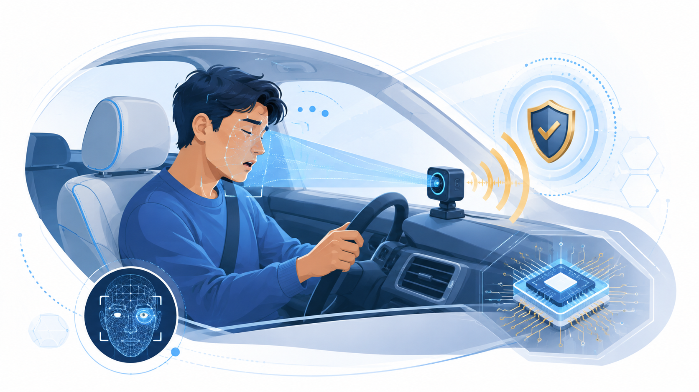

<div class="dg-hero" markdown>

<div class="dg-hero__content" markdown>

<p class="dg-eyebrow">RUPP · MITE COHORT 19 · IOT RESEARCH PROJECT</p>

# Safer drives begin with earlier warning

**DrowsyGuard** is a low-cost, camera-based driver drowsiness detection system
that runs locally on an ESP32-S3. It observes eyelid closure, blink duration,
yawning and head movement, then gives the driver an immediate spoken warning.

[Explore the system](getting-started/index.md){ .md-button .md-button--primary }
[View research proposal](research-proposal.md){ .md-button }

</div>

<figure class="dg-hero__visual">
  
  <figcaption>Private, offline detection with a local audio alert.</figcaption>
</figure>

</div>

There is no cloud dependency and no display to distract the driver. The board
raises its own Wi-Fi access point for diagnostics, while the safety-critical
audio alert remains local and continues to work when the dashboard is closed.

!!! warning "Research prototype"
    DrowsyGuard is a thesis research project. It is **not** a certified
    automotive safety device and must not be relied on to keep anyone awake.
    See [Security and safety](security.md).

## What it does

```text
camera -> YuNet face + 5 landmarks -> crop both eyes (32x32)
       -> eye-state model: P(closed) per eye        -> PERCLOS
       -> face geometry: jaw drop, head pitch, roll -> yawn / nod
       -> behaviour fusion (+ sneeze suppression)   -> risk score
       -> RiskFilter (sustained + cooldown)         -> spoken alert
```

Risk is measured from **eyelid closure over time**, not from a whole-face
"does this look drowsy" classifier. A face classifier trained on DDD learned to
recognise *drivers* rather than drowsiness; eye closure is the mechanism itself,
and it is cheaper on device — the model input is a 32×32 eye patch.

## Where to start

<div class="grid cards" markdown>

-   :material-rocket-launch: **[Getting started](getting-started/index.md)**

    Install the desktop toolkit, run the live dashboard against a webcam, and
    flash the board. No hardware needed for the first two.

-   :material-file-document-outline: **[Research proposal](research-proposal.md)**

    Read the academic scope, objectives, methodology, evaluation plan and team
    details, or download the complete A4 Word proposal.

-   :material-tools: **[Build the hardware](tutorials/hardware-setup/README.md)**

    From unopened parts to a working system: four components, seven wires,
    eleven labelled diagrams and a per-component test plan.

-   :material-book-open-variant: **[User manual](guide/index.md)**

    The firmware dev loop, the live dashboard, dataset preparation, training
    and export.

-   :material-api: **[API reference](reference/index.md)**

    The device HTTP API, the dashboard API, every CLI subcommand and the
    Python modules behind them.

-   :material-cog: **[Configuration](configuration/index.md)**

    Training YAML, the firmware headers that hold every pin and threshold, and
    the environment variables `plxy.sh` reads.

-   :material-server: **[Operations](operations/index.md)**

    Deployment, the on-device compute budget, and the documentation pipeline.

</div>

## Target hardware

| Part | Choice | Why |
| --- | --- | --- |
| MCU | ESP32-S3-WROOM-1 **N16R8** | 16 MB flash, 8 MB octal PSRAM — the camera framebuffers and ESP-DL models both live in PSRAM |
| Camera | OV5640 on the DVP/FPC connector | the board is sold as OV3660; units ship with an OV5640, so both drivers are pinned |
| Audio | MAX98357A I²S amplifier + 4 Ω / 3 W speaker | spoken warnings, no display to read |
| Interface | the board's own Wi-Fi AP | join `DrowsyGuard-XXXXXX`, open `http://192.168.4.1/` |
| Runtime | ESP-IDF + ESP-DL | INT8 `.espdl` models |

The whole build is **seven wires**: five to the amplifier and two to the
speaker. The camera is a ribbon and the interface is a web page, so neither
needs any.

## Behaviours, not just eye closure

Eye closure alone is not drowsiness, so the risk score fuses four cues
(`src/drowsyguard/behavior.py`):

| Cue | Weight | How it is measured |
| --- | --- | --- |
| PERCLOS | 0.55 | fraction of recent frames with eyes closed |
| Long/slow blinks | 0.20 | closures over 0.4 s, and microsleeps over 1.0 s |
| Yawning | 0.15 | jaw drop held above the driver's baseline for 1.2 s |
| Head nodding | 0.10 | downward pitch excursion returning within 1.5 s |

The geometric cues come from the five landmarks already available, so they add
**no model weight**. Each is measured against a rolling **per-driver baseline**,
so face shape and camera angle cancel out rather than becoming signal — the
same mistake that sank the whole-face classifier.

**Sneezes are detected but are not a drowsiness cue.** A sneeze slams the eyes
shut for about a second while the head jerks, which an eye-closure detector
would score as a microsleep. Detecting it lets the system *suppress* that false
alert instead of counting it.

!!! note "Unvalidated timings"
    The yawn/nod/sneeze thresholds in `behavior.py` are literature-informed
    defaults, not tuned on labelled video — this project has none yet. Their
    logic is unit-tested against synthetic traces; treat the event detectors as
    unvalidated on real drivers. `yaw` is computed but not validated.

## Project memory

`PROJECT_STATE.md`, `ROADMAP.md` and `CHANGELOG.md` live at the repository root
and are the running record of what has been tried. Read them, and the
[handoff protocol](AI_HANDOFF.md), before major changes.
