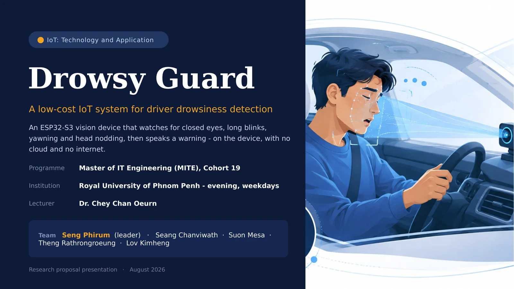
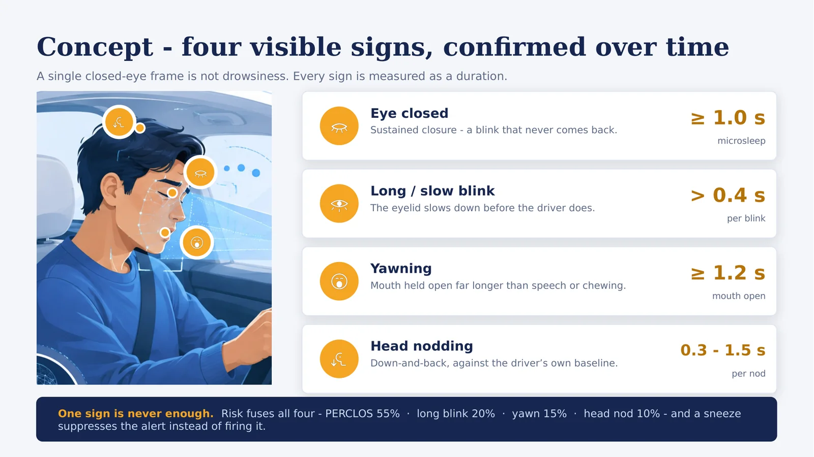
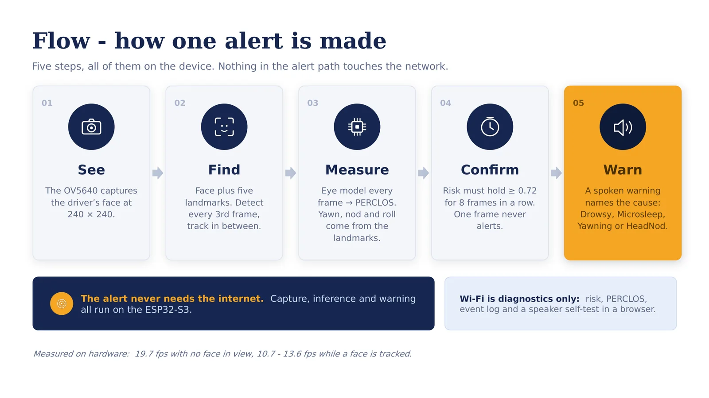
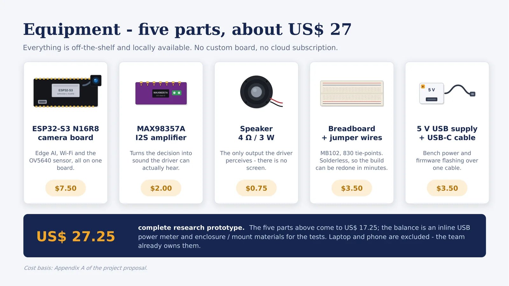
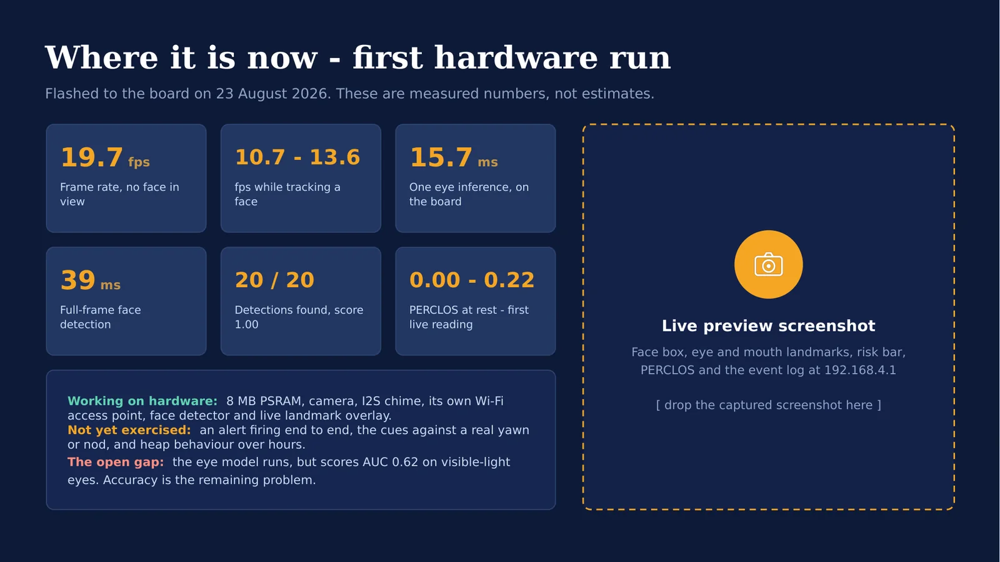
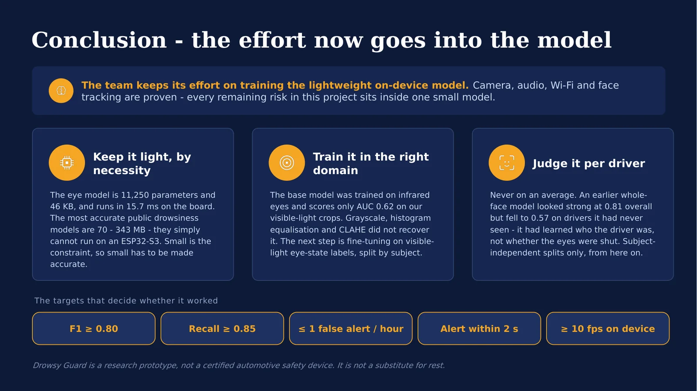

# Drowsy Guard presentation slides

A six-slide deck drawn from the [research proposal](research-proposal.md) and
from what the prototype has actually measured so far. It is deliberately short:
concept, flow, equipment, current results, conclusion - one idea per slide, each
carried by a picture rather than by bullets.

<div class="dg-download" markdown>

### Slide deck

16:9 widescreen, PowerPoint format, with speaker notes on every slide.

[Download the deck](assets/documents/DrowsyGuard-Presentation.pptx){ .md-button .md-button--primary }

</div>

## Also here: a deck that runs in the browser

A second deck, written independently, covers the same ground as eight slides in a
single self-contained HTML file - no PowerPoint needed. Arrow keys advance it,
`Ctrl+P` prints it as landscape A4, and it falls back to a drawn build diagram
until a real bench photo is dropped in.

[Open the browser deck](presentation/drowsyguard-slides.html) &middot;
[presenting, exporting and editing it](presentation/browser-deck.md)

The two are alternatives rather than halves of one thing - they were built in
parallel and overlap almost completely. Pick whichever suits the room, and retire
the other rather than maintaining both.

## What is on each slide

| # | Slide | The one point it makes |
| --- | --- | --- |
| 1 | Title | What the device is, who built it, and that it runs with no cloud. |
| 2 | Concept | Drowsiness is a **duration**, not a frame - four signs, each with its threshold. |
| 3 | Flow | See → Find → Measure → Confirm → Warn, all five steps on the device. |
| 4 | Equipment | Five off-the-shelf parts, about US$ 27 in total. |
| 5 | Where it is now | The measured numbers from the first hardware run, and the gap that remains. |
| 6 | Conclusion | The effort now goes into training the lightweight on-device model. |

## Slides

<figure markdown>
{ loading=lazy }
<figcaption>1 - Title</figcaption>
</figure>

<figure markdown>
{ loading=lazy }
<figcaption>2 - Concept: eye closure ≥ 1.0 s, long blink > 0.4 s, yawn ≥ 1.2 s, head nod 0.3-1.5 s</figcaption>
</figure>

<figure markdown>
{ loading=lazy }
<figcaption>3 - Flow: See, Find, Measure, Confirm, Warn</figcaption>
</figure>

<figure markdown>
{ loading=lazy }
<figcaption>4 - Equipment, priced from Appendix A of the proposal</figcaption>
</figure>

<figure markdown>
{ loading=lazy }
<figcaption>5 - Where it is now, from the 23 August 2026 hardware run</figcaption>
</figure>

<figure markdown>
{ loading=lazy }
<figcaption>6 - Conclusion and the targets that decide success</figcaption>
</figure>

!!! warning "Slide 5 has an empty screenshot panel"
    The dashed panel on the results slide is a deliberate slot for a screenshot of
    the live preview at `192.168.4.1` - face box, landmarks, risk bar and event
    log. Capture one from a running board and drop it in before presenting. The
    numbers beside it are already real and need no change.

## Rebuilding the deck

The deck is generated, not hand-edited, so a change to a threshold or a measured
number is a one-line edit and a rebuild:

```bash
cd scripts/presentation
npm install          # pptxgenjs + sharp, first time only
npm run build        # writes docs/assets/documents/DrowsyGuard-Presentation.pptx
```

`gen_assets.js` draws every illustration - the component art and cue icons as SVG,
the two photographs as crops of `docs/assets/images/drowsy-guard-cover.png` - into
`scripts/presentation/build/`. `build_deck.js` then lays out the six slides. Neither
the intermediate art nor `node_modules/` is tracked; the built `.pptx` is.

Editing the file directly in PowerPoint works too, but the next rebuild overwrites
it - put lasting changes in `build_deck.js`.
