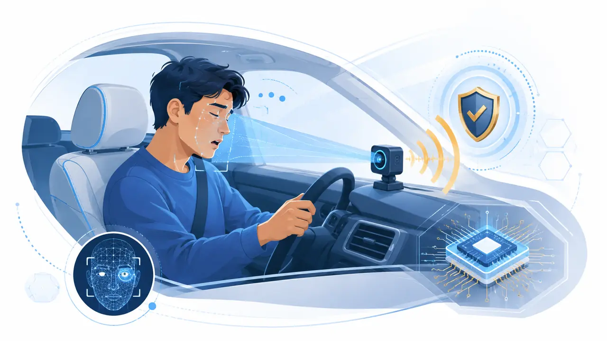

# Drowsy Guard research proposal

An IoT research project from the **Master of Information Technology Engineering
(MITE), Cohort 19** at the **Royal University of Phnom Penh (RUPP)**.

<figure class="dg-proposal-cover" markdown>

{ width="1280" height="720" loading=lazy }

</figure>

### Complete A4 proposal

The full proposal follows the provided research template and includes the
problem statement, objectives, research questions, methodology, system design,
evaluation plan, timeline, budget, risks and references.

[Download the Word proposal](assets/documents/Drowsy_Guard_Research_Project_Proposal.docx){ .md-button .md-button--primary }

## Project information

| Item | Details |
| --- | --- |
| Project title | Drowsy Guard |
| Research area | Driver drowsiness detection |
| Subject | IoT: Technology and Application |
| Lecturer | Dr. Chey Chan Oeurn |
| Programme | Master of Information Technology Engineering (MITE) |
| Cohort | 19 |
| Shift | Evening – Weekdays |
| Institution | Royal University of Phnom Penh (RUPP) |
| Project code |  |
| Pilot location |  |

## Research team

| Role | Name |
| --- | --- |
| Project leader | Seng Phirum |
| Project member | Seang Chanviwath |
| Project member | Suon Mesa |
| Project member | Theng Rathrongroeung |
| Project member | Lov Kimheng |

## Proposal at a glance

Drowsy Guard investigates whether a low-cost ESP32-S3 vision device can detect
early signs of driver drowsiness and issue a timely local alert without relying
on cloud processing. The system combines eye closure, long blinks, yawning and
head movement, then applies a time-based risk filter before speaking a warning.

The study will measure detection performance, alert delay, false-alert rate and
on-device speed under controlled conditions. Video is processed locally; the
diagnostic dashboard supports testing but is not required for the alert.

!!! warning "Research use only"
    Drowsy Guard is a research prototype, not a certified automotive safety
    device. It must not be treated as a substitute for rest or safe driving.
