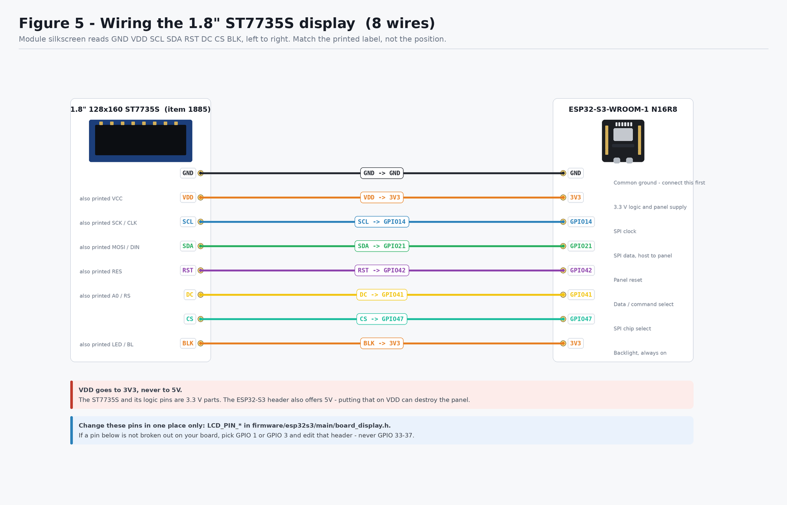

# DrowsyGuard hardware setup — from unopened boxes to a working system

A complete beginner's guide to assembling, wiring, flashing and testing the
DrowsyGuard driver-drowsiness prototype from the five parts on the order.

You do not need prior ESP32 experience. You do need to read section 5 (power)
before you connect anything, because two of the mistakes it describes destroy
parts permanently.

> **Status of this guide.** Every pin, voltage and threshold below is taken from
> the firmware headers in this repository or from the manufacturer datasheet
> cited at the end. **None of it has been executed against physical hardware** —
> no board existed in the environment where this was written. Treat every
> "you should see" as an expectation to verify, not as a reported result.
> Section 13 exists because some of them will not match on the first try.

---

## 0. The one-page version

If you want a single sheet to prop up next to the bench, this is the whole build on
one page. Everything on it is generated from the firmware headers, so the GPIO
numbers cannot drift away from what the board is actually told to drive.


*Print at A3 if you can. The rest of this document is the same information with the
reasoning attached — read section 5 (power) and section 6.4 (the amplifier's `SD`
pin) before you connect anything, because those are the two places where a
plausible-looking wiring choice destroys a part or silences the system.*

> **Two corrections worth calling out**, because both appear in tutorials for this
> exact hardware and both are backwards:
>
> - **`SD` to GND does not enable the amplifier — it shuts it down.** Below 0.16 V
>   the MAX98357A is in shutdown. Leave `SD` unconnected.
> - **`BLK` to GND turns the display's backlight off.** `BLK` goes to `3V3`.

---

## 1. What we are building

A dashboard-mounted camera that watches the driver's eyes, measures how long they
stay closed, and speaks a warning when sustained drowsiness is detected.

```
OV3660 camera ──DVP ribbon──► ESP32-S3  ──SPI──►  1.8" ST7735S display
                                 │                (what the driver sees)
                                 └────I2S────►  MAX98357A ──► 4 Ω speaker
                                                              (the warning)
```

| Stage | What happens | Where in this repo |
| --- | --- | --- |
| Capture | OV3660 delivers 240×240 RGB565 frames into PSRAM | `main/board_camera.h` |
| Detect | Face + 5 landmarks, every 3rd frame | `main/model_adapter.cpp` |
| Measure | Eye-closure probability → PERCLOS over a 3 s window | `main/behavior.cpp` |
| Fuse | PERCLOS + long blinks + yawns + nods → one risk score | `main/behavior.cpp` |
| Decide | Sustained risk + cooldown → alert edge | `main/risk_filter.cpp` |
| Warn | Reason-specific tone/speech over I2S, buzzer fallback | `main/voice_alert.cpp` |
| Show | Preview, face box, eye state, risk bar | `main/display_ui.cpp` |

The camera is the input, the display is feedback for the driver, and the
amplifier plus speaker is the output that actually wakes someone up. The
breadboard carries the shared 5 V, 3.3 V and ground rails that tie them together.

---

## 2. Required hardware


*Verify you have all five before starting. The two boards are easy to tell apart:
the controller is a large black PCB with two USB-C sockets, the amplifier is a
small purple PCB with a green screw terminal.*

| # | Exact product title as sold | khmeres item | Price | Role |
| --- | --- | --- | --- | --- |
| 1 | ESP32-S3 N16R8 development board with OV3660 | [2991](https://khmeres.com/product_detail/2991) | $7.50 | Controller + camera |
| 2 | 1.8 inch 128x160 ST7735S driver OLED color display 65K | [1885](https://khmeres.com/product_detail/1885) | $3.50 | Driver-facing display |
| 3 | MAX98357 I2S audio amplifier filterless class D | [2724](https://khmeres.com/product_detail/2724) | $2.00 | Alert amplifier |
| 4 | High quality speaker 3 watt 4 ohm 40mmX22mm | [2554](https://khmeres.com/product_detail/2554) | $0.75 | Alert loudspeaker |
| 5 | Breadboard 830 point solderless MB102 test board | [371](https://khmeres.com/product_detail/371) | $1.50 | Power rails + prototyping |

**Total: $15.25.**

> **The listing for item 1885 says "OLED". It is not an OLED.** The module's own
> silkscreen reads `1.8'128X160 RGB_TFT` and the driver is an ST7735S, which is a
> TFT LCD controller. This matters practically: the panel needs a backlight (the
> `BLK` pin), whereas an OLED would not. The firmware treats it as a TFT and that
> is correct.

### Not in the order — you still need these

| Item | Why | Substitute |
| --- | --- | --- |
| **USB-C data cable** | Flashing. A charge-only cable is the most common "board doesn't appear" cause | any USB-C cable known to carry data |
| **~15 jumper wires** | 8 for the display, 5 for the amplifier, 2 spare | male-to-female if the modules have male headers |
| **Soldering iron + solder** | The display and amplifier ship with **loose** header strips | a friend with an iron; these cannot be reliably used unsoldered |
| Buzzer (optional) | Fallback alert path already coded on GPIO 2 | any 3.3 V active buzzer |

> **You will almost certainly have to solder.** Looking at the product photos for
> items 1885 and 2724, both ship with their pin headers as separate loose strips.
> Until those are soldered the modules cannot make reliable contact with jumper
> wires or the breadboard. This is the one step in this guide that needs a tool
> you were not sold.

---

## 3. Required software

| Software | Version | Why that version |
| --- | --- | --- |
| **ESP-IDF** | **v5.4.x** (offline installer) | v5.3 is the minimum for the ESP-DL 3.x components used later; the offline installer bundles Python 3.11, which matters because ESP-IDF 5.4 supports Python 3.9–3.12 only |
| USB-serial driver | CH34x / CP210x | installed by the ESP-IDF installer; needed for the UART port |
| Python | 3.10+ | desktop tooling only, not needed to flash |
| Git | any | to clone this repository |

The firmware also pulls two managed components automatically on first
`idf.py reconfigure` — you do not install these by hand:

- `espressif/esp32-camera` `^2.1.7` — OV3660 DVP driver
- `waveshare/esp_lcd_st7735` `^1.0.1` — ST7735S panel driver (ESP-IDF ships
  ST7789/ILI9341/GC9A01 in-tree, but not ST7735S)

---

## 4. Identify every hardware component

### 4.1 The controller board


*Check: your board has **two** USB-C sockets side by side on one edge. Find the
one silkscreened `UART` — that is the one you will plug into. If both are
unlabelled, plug into either, and if no COM port appears, use the other.*

Key features to locate before you start:

- **ESP32-S3-WROOM-1 N16R8 module** — the metal-canned module. `N16R8` means
  16 MB flash and **8 MB octal PSRAM**. The octal part is critical; see §8.
- **Antenna** — at one end of the module. Keep metal away from it.
- **Camera FPC connector** — a wide flat socket with a hinged black latch.
- **Two USB-C ports** — `UART` (through a CH340/CP2102 bridge) and `USB`/OTG
  (the S3's native USB). **Use UART.**
- **BOOT and RESET buttons** — small tactile buttons.
- **Two pin headers** — one strip down each long edge.

### 4.2 The GPIO map — read this before choosing any pin


*Check: of 49 GPIOs, only **GPIO 1 and GPIO 3** remain free after this build. If
you need a pin for something else, it must be one of those two.*

> **Pin positions are not drawn anywhere in this guide, deliberately.** The
> top-to-bottom order of pins on this board's headers varies between production
> batches, and it could not be verified against a datasheet while writing this.
> **Always match the printed label on the board** (`GPIO14`, `3V3`, `GND`, `5V`),
> never a position in a drawing.

| GPIO range | Status |
| --- | --- |
| 4–13, 15–18 | **Taken** — DVP camera bus, fixed by the board |
| 33–37 | **Never touch** — SPI flash + octal PSRAM. Driving one hangs the board |
| 19, 20 | Native USB D−/D+ |
| 43, 44 | UART0 console — `idf.py monitor` needs these |
| 0, 45, 46 | Strapping / BOOT |
| 48 | On-board RGB LED on most units |
| 14, 21, 41, 42, 47 | Used by the display in this build |
| 38, 39, 40 | Used by the I2S amplifier in this build |
| 2 | Buzzer fallback |
| **1, 3** | **Free** |

### 4.3 The camera


*Check: after step 3 the ribbon should not pull out under a gentle tug, and the
blue stiffener should sit flush against the connector body. This is the single
most common silent failure in the whole build.*

The camera needs **no jumper wires**. Its 14 signals run through the FPC ribbon
into the board's connector. `PWDN` and `RESET` are not routed on this board, so
the sensor is permanently powered and is reset over SCCB instead.

### 4.4 The display

Module silkscreen, left to right: `GND` `VDD` `SCL` `SDA` `RST` `DC` `CS` `BLK`.
Some batches print `VCC` for `VDD`, `SCK`/`CLK` for `SCL`, `MOSI`/`DIN` for `SDA`,
`RES` for `RST`, `A0`/`RS` for `DC` and `LED`/`BL` for `BLK`.

### 4.5 The amplifier

Module silkscreen: `LRC` `BCLK` `DIN` `GAIN` `SD` `GND` `VIN`, plus a two-way
green screw terminal for the speaker. Only five of those seven pins get wired;
`GAIN` and `SD` are left alone (§6.4).

### 4.6 The breadboard


*Check: hold the board so the long red/blue rail lines run left-to-right. The
five holes in each short column are one electrical node; the two halves either
side of the centre channel are **not** connected to each other.*

---

## 5. Power architecture


*Check before powering: the display `VDD` wire must land on a **3V3** pin and the
amplifier `VIN` wire on a **5V** pin. If those two are swapped, the display can be
destroyed. Trace both wires with a finger before plugging in the USB cable.*

| Component | Supply | Logic level | Notes |
| --- | --- | --- | --- |
| ESP32-S3-WROOM-1 | 3.3 V (on-board LDO from USB 5 V) | 3.3 V | |
| OV3660 camera | 3.3 V via the FPC | 3.3 V | nothing to wire |
| ST7735S display | **3.3 V only** | 3.3 V | 5 V on `VDD` can destroy it |
| MAX98357A | 2.5 V – 5.5 V, **use 5 V** | accepts 3.3 V logic | 3.2 W into 4 Ω needs 5 V |
| Speaker | driven by the amplifier | — | 4 Ω, 3 W, bridged output |

### Three rules

1. **Common ground.** Every `GND` on every module ties to the same net. Without
   it the I2S clock has no reference and the amplifier outputs noise or silence.
2. **No level shifters anywhere in this build.** The ESP32-S3 drives 3.3 V logic.
   The ST7735S is a 3.3 V part. The MAX98357A accepts 3.3 V logic while its `VIN`
   runs at 5 V — that combination is fine and is how the part is designed to be
   used. Adding a level shifter would only add failure modes.
3. **One supply.** Everything is powered from the single USB-C cable. If you later
   add a bench supply for the amplifier, its ground **must** still tie to the
   board ground.

### Current budget

The camera plus display plus an amplifier at full output can exceed what a weak
USB port or a thin cable delivers, and the symptom is a boot loop with
`Brownout detector was triggered`. `sdkconfig.defaults` already lowers the
brownout threshold so this does not masquerade as a camera fault, but the real
fix is a better cable, a powered hub, or a 5 V supply.

---

## 6. Wiring

Work with the USB cable **unplugged**. Connect ground first and remove it last —
that ordering means no module is ever powered through a signal pin, which is what
quietly damages I2S inputs.

### 6.1 The definitive wiring table

| From device | From pin | To device | To pin | Voltage / signal | Purpose |
| --- | --- | --- | --- | --- | --- |
| ST7735S display | `GND` | ESP32-S3 | `GND` | 0 V | Common ground |
| ST7735S display | `VDD` | ESP32-S3 | `3V3` | 3.3 V | Logic + panel supply |
| ST7735S display | `SCL` | ESP32-S3 | `GPIO 14` | 3.3 V digital | SPI clock |
| ST7735S display | `SDA` | ESP32-S3 | `GPIO 21` | 3.3 V digital | SPI data, host → panel |
| ST7735S display | `RST` | ESP32-S3 | `GPIO 42` | 3.3 V digital | Panel reset |
| ST7735S display | `DC` | ESP32-S3 | `GPIO 41` | 3.3 V digital | Data / command select |
| ST7735S display | `CS` | ESP32-S3 | `GPIO 47` | 3.3 V digital | SPI chip select |
| ST7735S display | `BLK` | ESP32-S3 | `3V3` | 3.3 V | Backlight, always on |
| MAX98357A | `GND` | ESP32-S3 | `GND` | 0 V | Common ground |
| MAX98357A | `VIN` | ESP32-S3 | `5V` | 5 V | Amplifier supply |
| MAX98357A | `BCLK` | ESP32-S3 | `GPIO 39` | 3.3 V digital | I2S bit clock |
| MAX98357A | `LRC` | ESP32-S3 | `GPIO 38` | 3.3 V digital | I2S word select |
| MAX98357A | `DIN` | ESP32-S3 | `GPIO 40` | 3.3 V digital | I2S data, ESP32-S3 → amp |
| MAX98357A | screw `+` | Speaker | either lead | amplified audio | Speaker drive |
| MAX98357A | screw `−` | Speaker | other lead | amplified audio | Speaker return |
| OV3660 camera | FPC ribbon | ESP32-S3 | FPC connector | — | 14-signal DVP bus |

**15 wires total.** The camera contributes none — it is the ribbon.

### 6.2 Step by step — display



*Check: eight wires, and `VDD` and `BLK` both land on `3V3`. Nothing from this
module goes anywhere near `5V`.*

1. Solder the 8-pin header strip to the display module if it is not already fitted.
2. `GND` → a `GND` pin on the ESP32-S3 (or the breadboard ground rail).
3. `VDD` → `3V3`.
4. `SCL` → `GPIO 14`.
5. `SDA` → `GPIO 21`.
6. `RST` → `GPIO 42`.
7. `DC` → `GPIO 41`.
8. `CS` → `GPIO 47`.
9. `BLK` → `3V3`.

To change any of these, edit `LCD_PIN_*` in
[`firmware/esp32s3/main/board_display.h`](../../../firmware/esp32s3/main/board_display.h)
— one place, nowhere else.

### 6.3 Step by step — amplifier and speaker


*Check: five wires to the board plus two to the speaker. `VIN` is the only wire in
the whole build that touches `5V`.*

1. Solder the header strip to the amplifier module.
2. `GND` → `GND`.
3. `VIN` → `5V`.
4. `BCLK` → `GPIO 39`.
5. `LRC` → `GPIO 38`.
6. `DIN` → `GPIO 40`.
7. Speaker leads into the green screw terminal, one per screw. Polarity does not
   matter — swapping them only inverts the waveform.

> **Never connect either speaker lead to ground.** The MAX98357A output is a
> bridged (BTL) pair: both terminals are actively driven, and grounding one
> shorts half the output stage.

To change these, edit `AUDIO_PIN_*` in
[`firmware/esp32s3/main/board_audio.h`](../../../firmware/esp32s3/main/board_audio.h).

### 6.4 The two amplifier pins you do not wire


*Check: leave both `GAIN` and `SD` unconnected on the first build. Come back to
this figure only if the amplifier is silent.*

**`GAIN`** — leave floating for the default 9 dB. That is already loud into a
4 Ω 3 W speaker, and `docs/VOICE_ALERT_HARDWARE.md` requires an alert that is
audible without being startling: a startled drowsy driver is itself a hazard.

**`SD`** — this pin both shuts the amplifier down and selects a channel:

| Voltage on `SD` | Result |
| --- | --- |
| below 0.16 V | Shut down — no output at all |
| 0.16 V – 0.77 V | (Left + Right) / 2 |
| 0.77 V – 1.4 V | Right channel only |
| above 1.4 V | Left channel only |

The firmware sidesteps this entirely: `board_audio.cpp` writes the **same sample
into both the left and right slot**, so all three non-shutdown modes sound
identical and it does not matter what your particular breakout pulls `SD` to. The
only failing case is a board that leaves `SD` below 0.16 V. If there is no sound
at all, measure `SD`; if it reads near 0 V, fit a 100 kΩ resistor from `SD` to
`VIN` to force left-channel mode.

### 6.5 Everything together


*Check: count your wires against this diagram before plugging in — 8 to the
display, 5 to the amplifier, 2 to the speaker. Then re-trace `VDD`→`3V3` and
`VIN`→`5V` one final time.*

---

## 7. Software setup

Written for Windows 11 / PowerShell, which is the development machine this
project targets.

### 7.1 Install ESP-IDF

1. Download the **offline installer for ESP-IDF v5.4.x** from
   <https://dl.espressif.com/dl/esp-idf/> (~1.5 GB). Not the small "Universal
   Online Installer" — the offline one bundles its own Python 3.11.
2. Install to a path with **no spaces and no non-ASCII characters**. `C:\Espressif`
   is the default and is correct. A path like `C:\Users\Phirum Seng\...` breaks CMake.
3. Tick the driver components (CP210x / FTDI / WCH-CH34x) when offered.
4. Let it finish completely — it keeps unpacking after the progress bar looks done.

### 7.2 Enable long paths

ESP-IDF build trees exceed the Windows 260-character limit. Once, in an
**Administrator** PowerShell, then reboot:

```powershell
New-ItemProperty -Path 'HKLM:\SYSTEM\CurrentControlSet\Control\FileSystem' `
  -Name LongPathsEnabled -Value 1 -PropertyType DWORD -Force
```

### 7.3 Open an ESP-IDF shell

`idf.py` is **not** a global command and never appears on the system PATH. An
ordinary terminal will always say `idf.py not found`.

Start menu → **ESP-IDF 5.4 PowerShell**. Then:

```powershell
idf.py --version    # expect: ESP-IDF v5.4.x
```

To get the same environment in a terminal you already have open:

```powershell
. C:\Espressif\frameworks\esp-idf-v5.4.4\export.ps1
```

### 7.4 Find the board

Plug the USB-C cable into the **UART** port, then:

```powershell
[System.IO.Ports.SerialPort]::GetPortNames()
```

Nothing listed? In order: try another cable (must carry data), check Device
Manager for a yellow-triangle "USB2.0-Serial" and install the
[WCH CH34x driver](https://www.wch-ic.com/downloads/CH341SER_EXE.html), then try
the other USB-C port.

### 7.5 Prove the toolchain before touching this project

Five minutes here saves an hour of misattributed errors later:

```powershell
cd $env:USERPROFILE
Copy-Item -Recurse "$env:IDF_PATH\examples\get-started\hello_world" .\hw_test
cd .\hw_test
idf.py set-target esp32s3
idf.py -p COM5 flash monitor      # substitute your port
```

Expect a chip banner and a countdown. `Ctrl+]` exits the monitor.

---

## 8. Project configuration

Everything the board needs is already committed. These are the files that decide
whether it works, and what to change if your hardware differs.

| File | What it controls | Change it when |
| --- | --- | --- |
| `firmware/esp32s3/main/board_display.h` | `LCD_PIN_*`, panel size, SPI speed, window offset | you wire the display to different pins, or see colour/offset artefacts |
| `firmware/esp32s3/main/board_audio.h` | `AUDIO_PIN_*`, sample rate, tone amplitude | you wire the amplifier to different pins, or it is too loud/quiet |
| `firmware/esp32s3/main/board_camera.h` | DVP pin map, frame size, byte order | never, unless your board is not this board |
| `firmware/esp32s3/sdkconfig.defaults` | PSRAM mode, flash size, CPU speed, sensor support | see the table below |
| `firmware/esp32s3/partitions.csv` | 6 MB app + 4 MB asset partition | you embed large audio clips |
| `firmware/esp32s3/main/main.cpp` | `RISK_TRIGGER` (0.55) | after tuning on the desktop dashboard |

`idf.py set-target esp32s3` seeds `sdkconfig` from `sdkconfig.defaults`, which
already sets the things that are easy to get wrong:

| Setting | Value | Consequence if wrong |
| --- | --- | --- |
| `CONFIG_SPIRAM` | `y` | camera cannot allocate framebuffers |
| `CONFIG_SPIRAM_MODE_OCT` | `y` | **an R8 board reports 0 B PSRAM in quad mode** |
| `CONFIG_ESPTOOLPY_FLASHSIZE_16MB` | `y` | truncated image / boot loop |
| `CONFIG_OV3660_SUPPORT` | `y` | sensor not detected (`0x105`) |
| `CONFIG_ESP_DEFAULT_CPU_FREQ_MHZ_240` | `y` | roughly half the frame rate |

---

## 9. Code / firmware setup

The I2S audio path for the MAX98357A is **already integrated** in this
repository — you do not have to write it:

| File | What it does |
| --- | --- |
| `main/board_audio.h` / `.cpp` | I2S bring-up on GPIO 38/39/40, PCM playback, tone generator |
| `main/voice_alert.cpp` | Alert state machine, reason-specific tone patterns, buzzer fallback |
| `main/main.cpp` | Plays an 880 Hz chirp at boot as a built-in audio self-test |

Two design points worth knowing:

- **Playback runs on its own FreeRTOS task.** The capture loop has a ~23 ms frame
  budget; playing even a half-second alert inline would drop roughly twenty
  frames and freeze the preview at the exact moment the driver needs it.
- **Mono is written to both I2S slots**, which is what makes the amplifier's
  `SD` pin configuration irrelevant (§6.4).

Recorded speech is not committed. Until approved English/Khmer clips exist (see
`firmware/esp32s3/assets/audio/README.md`), each alert reason plays a distinct
tone pattern — a real, audible alert rather than a log line.

### Build and flash

```powershell
cd <repo>\firmware\esp32s3
idf.py set-target esp32s3          # seeds sdkconfig from sdkconfig.defaults
idf.py reconfigure                 # fetches managed components, writes dependencies.lock
idf.py build
idf.py -p COM5 flash monitor       # substitute your port
```

If flashing refuses to start: **hold BOOT, tap RESET, release BOOT**, then flash.

---

## 10. First power-on

Do this in order. Do not skip to the last step.

1. **USB unplugged.** Re-check the wiring table in §6.1 one wire at a time.
2. Confirm `VDD` → `3V3` and `VIN` → `5V`. These are the two that destroy parts.
3. Confirm no wire touches `GPIO 33`–`GPIO 37`.
4. Confirm the camera ribbon is latched.
5. Plug the USB-C cable into the **UART** port.
6. **Watch and smell for the first five seconds.** Any heat, smell or visible
   smoke — unplug immediately and re-check §6.1.
7. Run `idf.py -p COM5 flash monitor`.


*Check: you should **hear one short beep** and **see a live preview** with
`NO MODEL - PREVIEW` on the bottom line. The beep proves the amplifier, the I2S
pins and the speaker in one step; the preview proves the camera, the panel, the
pin map, PSRAM and the power supply.*

These two lines must appear in the boot log:

```
I (xxx) esp_psram: Found 8MB PSRAM device
I (xxx) esp_psram: Adding pool of 8192K of PSRAM memory to heap allocator
```

If it reports 2 MB, or nothing, **stop** and fix `CONFIG_SPIRAM_MODE_OCT` before
anything else. Everything downstream will misbehave in ways that look unrelated.

---

## 11. Testing each component individually

Test in this order. Each step assumes the previous one passed.

| # | Component | How to test | Pass looks like |
| --- | --- | --- | --- |
| 1 | Toolchain | `idf.py --version` | `ESP-IDF v5.4.x` |
| 2 | USB / serial | `[System.IO.Ports.SerialPort]::GetPortNames()` | a `COM` port appears |
| 3 | Board | flash `hello_world` | chip banner + countdown |
| 4 | PSRAM | flash DrowsyGuard, read the boot log | `Found 8MB PSRAM device` |
| 5 | **Audio** | listen at boot | one short 880 Hz beep |
| 6 | Display | look at the panel | backlight on, UI text drawn |
| 7 | Camera | look at the top of the panel | live moving preview |
| 8 | Frame rate | read the once-a-second log line | `fps` above 15 |
| 9 | Alert path | temporarily call `voice_alert_trigger(now_ms, AlertReason::Drowsy)` in the per-second log branch of `main.cpp` | two 880 Hz beeps + `DROWSY` banner |

Testing audio before the display is deliberate: the boot chirp is the cheapest
signal in the system, and if it is silent you know the fault is in the audio path
rather than anywhere else.

---

## 12. Full system test

With all components passing individually:

1. Flash and let the board run for a full minute.
2. Confirm the once-a-second log line advances and `fps` stays above 15:
   ```
   I (xxx) drowsyguard: fps 24.3  risk 0.00  perclos 0.00  heap ...  psram ...
   ```
3. Sit in front of the camera. The preview should track you; the face box should
   appear once ESP-DL is bound (stage 3).
4. Confirm `heap` and `psram` are stable across a minute — a falling number is a
   leak, and `docs/DEPLOYMENT.md` has a one-hour heap-stability acceptance test.
5. Trigger an alert (row 9 above) and confirm the tone plays **and** the preview
   keeps updating during playback. If the preview freezes while the tone plays,
   the audio task is not running and something is wrong with §9.

At this point the hardware is proven. What remains is model work, not wiring:
`docs/HARDWARE_SETUP.md` §8 covers binding ESP-DL, and `PROJECT_STATE.md` gap 6
explains why the eye model still classifies poorly in visible light.

---

## 13. Troubleshooting

### Power and connection

| Symptom | Likely cause | Fix |
| --- | --- | --- |
| No COM port | Charge-only cable, or missing CH34x driver | Data cable; install driver; try the other USB-C port |
| `idf.py not found` | Plain terminal instead of an ESP-IDF shell | Use the ESP-IDF PowerShell shortcut, or dot-source `export.ps1` |
| Works in one terminal, not another | `export.ps1` is per-session | Re-run it in each new terminal |
| `Failed to connect ... Wrong boot mode` | Not in download mode | Hold BOOT, tap RESET, release BOOT, reflash |
| Boot loop, `Brownout detector was triggered` | USB port cannot supply camera + LCD + amp | Powered hub, shorter/thicker cable, or a 5 V supply |
| Nothing at all, board warm | Short, or a supply wire on the wrong pin | Unplug. Re-check `VDD`→`3V3` and `VIN`→`5V` |

### Camera

| Symptom | Likely cause | Fix |
| --- | --- | --- |
| `esp_camera_init failed: 0x105` | Ribbon half-seated, PSRAM off, or wrong pin map | Reseat the ribbon; check the 8 MB PSRAM line; check `CONFIG_OV3660_SUPPORT` |
| `esp_camera_init failed: 0x101` | PSRAM not enabled | `CONFIG_SPIRAM=y` **and** `CONFIG_SPIRAM_MODE_OCT=y` |
| Preview mirrored the wrong way | Mounting orientation | `set_hmirror` / `set_vflip` in `board_camera_tune()` |
| Preview psychedelic, UI text fine | Camera/framebuffer byte order | Set `CAM_RGB565_BYTE_SWAP` to `0` in `board_camera.h` |

### Display

| Symptom | Likely cause | Fix |
| --- | --- | --- |
| Backlight on, screen white | Wrong CS/DC/RST, or SPI too fast | Re-check the four control pins; drop `LCD_SPI_HZ` to 20 MHz |
| Backlight on, screen black | Panel init ran but nothing blits | Look for the `ST7735S 128x160 up` log line |
| Coloured bands on two edges, image shifted | "Red tab" panel variant needs a window offset | Set `LCD_GAP_X`/`LCD_GAP_Y` to `2`/`1` (or `2`/`3`) |
| Red and blue swapped | Panel is RGB, not BGR | `LCD_RGB_ELEMENT_ORDER_RGB` in `board_display.cpp` |
| Image looks like a negative | Some ST7735S batches invert | `esp_lcd_panel_invert_color(s_panel, true)` |
| Nothing at all, backlight off | `BLK` not connected | `BLK` → `3V3` |

### Audio

| Symptom | Likely cause | Fix |
| --- | --- | --- |
| No boot beep, log says `output=buzzer` | I2S failed to initialise | Check `AUDIO_PIN_*` do not collide with §4.2 |
| No boot beep, log says `output=I2S/MAX98357A` | Wiring, or the amplifier is shut down | Check `GND`, `VIN`, then measure `SD` — below 0.16 V means shutdown (§6.4) |
| Loud hiss or buzz, no tone | Missing common ground | Tie every module `GND` together |
| Very quiet | `VIN` on `3V3` instead of `5V` | Move `VIN` to `5V` |
| Distorted / clipping | Gain too high for the speaker | Lower `AUDIO_TONE_AMPLITUDE` in `board_audio.h` |
| Tone plays but preview freezes | Playback running inline, not on its task | Confirm `voice_alert_init` returned true |
| Click at the start of every tone | Ramp too short | Increase the 5 ms ramp in `board_audio_play_tone` |

### Build

| Symptom | Likely cause | Fix |
| --- | --- | --- |
| CMake path errors, `filename too long` | Project or IDF in a path with spaces, or long paths disabled | Reinstall IDF to `C:\Espressif`; enable `LongPathsEnabled` |
| `esp_lcd_st7735.h: No such file` | Managed components not fetched | `idf.py reconfigure` |
| `driver/i2s_std.h: No such file` | ESP-IDF older than v5.0 | Install v5.4.x — the legacy `i2s.h` API is not used here |
| `fps` far below 15 | CPU at 160 MHz, or SPI at 20 MHz | Check `CONFIG_ESP_DEFAULT_CPU_FREQ_MHZ_240`; raise `LCD_SPI_HZ` |

---

## 14. Final verification checklist

- [ ] All five components identified and accounted for
- [ ] Header strips soldered to the display and amplifier
- [ ] Camera ribbon latched and does not pull out
- [ ] Display `VDD` on `3V3` — **not** `5V`
- [ ] Amplifier `VIN` on `5V`
- [ ] Every module `GND` on a common ground
- [ ] No wire on `GPIO 33`–`GPIO 37`
- [ ] All 15 connections match the table in §6.1
- [ ] ESP-IDF v5.4.x installed, `idf.py --version` works
- [ ] `hello_world` flashes and runs
- [ ] Boot log shows `Found 8MB PSRAM device`
- [ ] One short beep at boot
- [ ] Backlight on, UI text drawn
- [ ] Live camera preview visible
- [ ] `fps` above 15
- [ ] Heap and PSRAM stable over a minute
- [ ] Manual alert produces a tone without freezing the preview

---

## 15. References

**Product listings**

- [khmeres.com item 2991 — ESP32-S3 N16R8 development board with OV3660](https://khmeres.com/product_detail/2991)
- [khmeres.com item 1885 — 1.8 inch 128x160 ST7735S display](https://khmeres.com/product_detail/1885)
- [khmeres.com item 2724 — MAX98357 I2S audio amplifier filterless class D](https://khmeres.com/product_detail/2724)
- [khmeres.com item 2554 — High quality speaker 3 watt 4 ohm 40mmX22mm](https://khmeres.com/product_detail/2554)
- [khmeres.com item 371 — Breadboard 830 point solderless MB102 test board](https://khmeres.com/product_detail/371)

**Datasheets and component documentation**

- MAX98357A/MAX98357B PCM Input Class D Audio Power Amplifiers — Analog Devices
  (supply range, `SD_MODE` thresholds, `GAIN_SLOT` table, 3.2 W into 4 Ω at 5 V,
  filterless output stage)
- [Adafruit MAX98357 I2S Class-D Mono Amp — pinouts](https://learn.adafruit.com/adafruit-max98357-i2s-class-d-mono-amp/pinouts)
  (`SD` internal 100 kΩ pulldown and pull-up selection)
- [keyestudio MB0184 ESP32-S3 CAM pin table](https://docs.keyestudio.com/projects/MB0184/en/latest/docs/MB0184%20ESP32-S3%20CAM%20Development%20Board.html)
- [arduino-esp32 `camera_pins.h` (ESP32S3_EYE map)](https://github.com/espressif/arduino-esp32/blob/master/libraries/ESP32/examples/Camera/CameraWebServer/camera_pins.h)
- [espressif/esp32-camera component](https://components.espressif.com/components/espressif/esp32-camera)
- [waveshare/esp_lcd_st7735 component](https://components.espressif.com/components/waveshare/esp_lcd_st7735)

**In this repository**

- [`docs/HARDWARE_SETUP.md`](../../HARDWARE_SETUP.md) — toolchain reference and the ESP-DL binding stages
- [`docs/VOICE_ALERT_HARDWARE.md`](../../VOICE_ALERT_HARDWARE.md) — alert architecture and thesis measurements
- [`docs/FIRMWARE_PIPELINE.md`](../../FIRMWARE_PIPELINE.md) — frame budget
- [`docs/DEPLOYMENT.md`](../../DEPLOYMENT.md) — hardware acceptance tests
- [`PROJECT_STATE.md`](../../../PROJECT_STATE.md) — known gaps

---

## About the diagrams

Every figure is generated by
[`scripts/generate_tutorial_diagrams.py`](../../../scripts/generate_tutorial_diagrams.py)
from the same constants the firmware uses, and
[`tests/test_tutorial_diagrams.py`](../../../tests/test_tutorial_diagrams.py)
fails the build if a drawing and a firmware header ever disagree. To regenerate:

```bash
python scripts/generate_tutorial_diagrams.py
```
