# DrowsyGuard hardware setup — from unopened boxes to a working system

A complete beginner's guide to assembling, wiring, flashing and testing the
DrowsyGuard driver-drowsiness prototype from the four parts on the order.

There is **no screen to wire**. The board serves its own live preview over
Wi-Fi, so the display is whatever phone or laptop you already own - which is
why this build is seven wires rather than fifteen.

You do not need prior ESP32 experience. You do need to read section 5 (power)
before you connect anything, because two of the mistakes it describes destroy
parts permanently.

> **Status of this guide.** Every pin, voltage and threshold below is taken from
> the firmware headers in this repository or from the manufacturer datasheet
> cited at the end. **None of it has been executed against physical hardware** —
> no board existed in the environment where this was written. Treat every
> "you should see" as an expectation to verify, not as a reported result.
> Section 13 exists because some of them will not match on the first try.

---

## 0. The one-page version

If you want a single sheet to prop up next to the bench, this is the whole build on
one page. Everything on it is generated from the firmware headers, so the GPIO
numbers cannot drift away from what the board is actually told to drive.

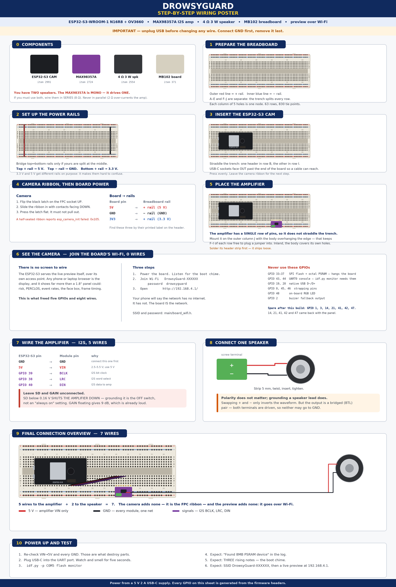

*Print at A3 if you can. The rest of this document is the same information with the
reasoning attached — read section 5 (power) and section 6.4 (the amplifier's `SD`
pin) before you connect anything, because those are the two places where a
plausible-looking wiring choice destroys a part or silences the system.*

> **Two corrections worth calling out**, because both appear in tutorials for this
> exact hardware and both are backwards:
>
> - **`SD` to GND does not enable the amplifier — it shuts it down.** Below 0.16 V
>   the MAX98357A is in shutdown. Leave `SD` unconnected.
> - **A phone warning that the Wi-Fi network has no internet is the correct
>   result, not an error.** The board *is* the network; there is no uplink to
>   the internet and there does not need to be.

---

## 1. What we are building

A dashboard-mounted camera that watches the driver's eyes, measures how long they
stay closed, and speaks a warning when sustained drowsiness is detected.

```
camera ──DVP ribbon──► ESP32-S3 ──I2S──► MAX98357A ──► 4 Ω speaker
                          │                            (the warning)
                          ├──Wi-Fi──► your phone's browser
                          │           (preview + all the numbers)
                          └──SDMMC──► microSD card
                                      (the frame behind every alert)
```

| Stage | What happens | Where in this repo |
| --- | --- | --- |
| Capture | OV3660 delivers 240×240 RGB565 frames into PSRAM | `main/board_camera.h` |
| Detect | Face + 5 landmarks, every 3rd frame | `main/model_adapter.cpp` |
| Measure | Eye-closure probability → PERCLOS over a 3 s window | `main/behavior.cpp` |
| Fuse | PERCLOS + long blinks + yawns + nods → one risk score | `main/behavior.cpp` |
| Decide | Sustained risk + cooldown → alert edge | `main/risk_filter.cpp` |
| Warn | Reason-specific tone/speech over I2S, buzzer fallback | `main/voice_alert.cpp` |
| Serve | SoftAP, MJPEG preview, status JSON, controls | `main/web_server.cpp` |
| Keep | The frame that caused each alert, on microSD | `main/board_sdcard.cpp` |
| Show | Preview, face box, risk, PERCLOS, event log, in a browser | `main/web/index.html` |

The camera is the input, the speaker is the output that actually wakes someone
up, and the browser is how a developer or an examiner sees what the system
thinks. The breadboard carries the shared 5 V and ground rails.

The preview is a **diagnostic, not a dependency**: the detection loop hands over
a frame and returns immediately, and skips the copy entirely when no page is
open. Nothing about the alert path changes when nobody is watching.

---

## 2. Required hardware

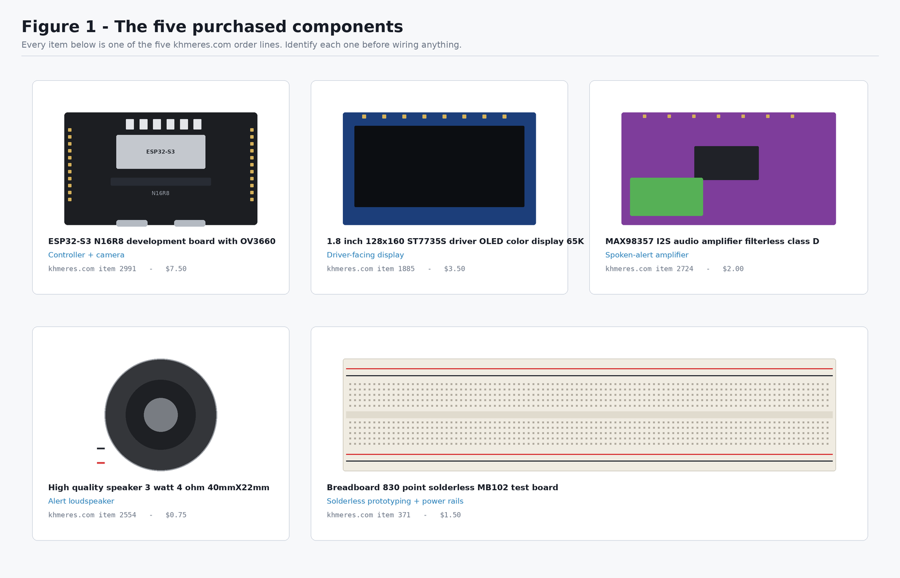

*Verify you have all four before starting. The two boards are easy to tell apart:
the controller is a large black PCB with two USB-C sockets, the amplifier is a
small purple PCB with a green screw terminal.*

| # | Exact product title as sold | khmeres item | Price | Role |
| --- | --- | --- | --- | --- |
| 1 | ESP32-S3 N16R8 development board with OV3660 | [2991](https://khmeres.com/product_detail/2991) | $7.50 | Controller + camera |
| 2 | MAX98357 I2S audio amplifier filterless class D | [2724](https://khmeres.com/product_detail/2724) | $2.00 | Alert amplifier |
| 3 | High quality speaker 3 watt 4 ohm 40mmX22mm | [2554](https://khmeres.com/product_detail/2554) | $0.75 | Alert loudspeaker |
| 4 | Breadboard 830 point solderless MB102 test board | [371](https://khmeres.com/product_detail/371) | $1.50 | Power rails + prototyping |

**Total: $11.75.**

> **A screen is no longer on the parts list.** Earlier revisions of this build
> wired a 1.8" SPI panel (khmeres item 1885) and eight jumper wires to it. The
> preview now comes out of the board over Wi-Fi instead, which is both cheaper
> and strictly more useful: a phone shows the frame *and* the risk score, the
> PERCLOS window, the event rates and the frame timing, at a size you can
> actually read. If you already bought the panel, nothing here needs it - keep
> it for another project.

### Not in the order — you still need these

| Item | Why | Substitute |
| --- | --- | --- |
| **USB-C data cable** | Flashing. A charge-only cable is the most common "board doesn't appear" cause | any USB-C cable known to carry data |
| **~8 jumper wires** | 5 for the amplifier, 2 for the speaker, 1 spare | male-to-female if the module has male headers |
| **A phone or laptop** | It *is* the display. Any browser will do | you already have one |
| **A microSD card** | Holds the frame behind every alert, so warnings can be reviewed | any FAT32 card; 1 GB is already far more than enough |
| **Soldering iron + solder** | The amplifier ships with a **loose** header strip | a friend with an iron; it cannot be reliably used unsoldered |
| Buzzer (optional) | Fallback alert path already coded on GPIO 2 | any 3.3 V active buzzer |

> **You will probably have to solder once.** Item 2724 ships with its pin header
> as a separate loose strip, and until it is soldered the module cannot make
> reliable contact with jumper wires or the breadboard. That is the only
> soldering in the build, and the one step that needs a tool you were not sold.

---

## 3. Required software

| Software | Version | Why that version |
| --- | --- | --- |
| **ESP-IDF** | **v5.4.x** (offline installer) | v5.3 is the minimum for the ESP-DL 3.x components used later; the offline installer bundles Python 3.11, which matters because ESP-IDF 5.4 supports Python 3.9–3.12 only |
| USB-serial driver | CH34x / CP210x | installed by the ESP-IDF installer; needed for the UART port |
| Python | 3.10+ | desktop tooling only, not needed to flash |
| Git | any | to clone this repository |

The firmware pulls its managed components automatically on first
`idf.py reconfigure` — you do not install these by hand:

- `espressif/esp32-camera` `^2.1.7` — OV3660 DVP driver, and the JPEG encoder
  the web preview uses
- `espressif/esp-dl` and `espressif/human_face_detect` — the detection models

Nothing extra is needed for the preview itself: the Wi-Fi stack and the HTTP
server ship with ESP-IDF, and the page is compiled into the firmware binary.

---

## 4. Identify every hardware component

### 4.1 The controller board

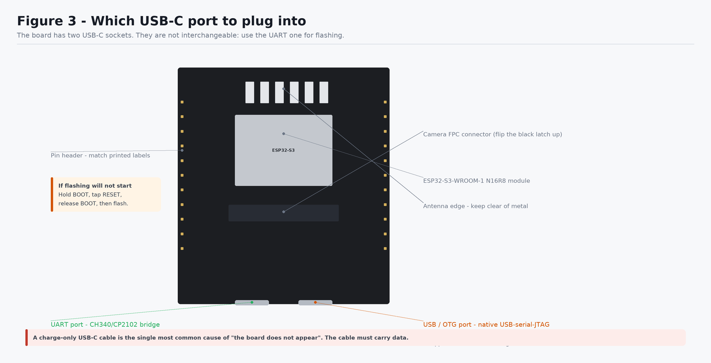

*Check: your board has **two** USB-C sockets side by side on one edge. Find the
one silkscreened `UART` — that is the one you will plug into. If both are
unlabelled, plug into either, and if no COM port appears, use the other.*

Key features to locate before you start:

- **ESP32-S3-WROOM-1 N16R8 module** — the metal-canned module. `N16R8` means
  16 MB flash and **8 MB octal PSRAM**. The octal part is critical; see §8.
- **Antenna** — at one end of the module. Keep metal away from it.
- **Camera FPC connector** — a wide flat socket with a hinged black latch.
- **Two USB-C ports** — `UART` (through a CH340/CP2102 bridge) and `USB`/OTG
  (the S3's native USB). **Use UART.**
- **BOOT and RESET buttons** — small tactile buttons.
- **Two pin headers** — one strip down each long edge.

### 4.2 The GPIO map — read this before choosing any pin

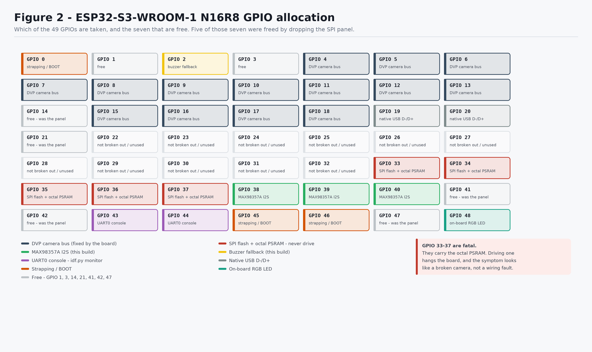

*Check: of 49 GPIOs, **three** are free after this build - GPIO 14, 21 and 47.*

### The physical header order

Verified from a photograph of the board on 2026-08-23. Earlier revisions of this
guide said it could not be verified and keyed every instruction to the printed
label instead — still good advice, but you can now count holes as well:

```
top     5V  14  13  12  11  10   9  46   3   8  18  17  16  15   7   6   5   4  EN 3V3
bottom  GND 19  20  21  47  48  45   0  35  36  37  38  39  40  41  42   2   1  RX  TX
```

**Everything you wire by hand is on the bottom row, on three adjacent pins.** That
is deliberate, and it is why the amplifier is where it is:

- the **top row is almost entirely the DVP camera bus** — only GPIO 14 and 3 are
  free on it, and there is no `GND` on it at all, so it cannot carry a module;
- on the bottom row, `41 42 2 1` is the only run of consecutive free pins. The
  amplifier takes the first three and the buzzer, if you fit one, takes the fourth;
- `38 39 40` on that row are the **microSD slot's SDMMC bus**, fixed by the PCB.
  The amplifier used to sit there while the slot was empty; the card evicted it.

The one exception is `5V`, which exists only at the top-left. It goes to the
breadboard's `+` rail, which this build sets up anyway (§6.2), so in practice it is
not an extra reach across the board.

> **Following an older diagram?** The amplifier's three signal wires have moved
> twice: `39/38/40` → `14/21/47` → **`41/42/2`**. Still seven wires in total.

> **GPIO 3 is not free**, despite older revisions of this guide saying so. On the
> ESP32-S3 it is the JTAG-source strapping pin. Usable after boot, but not
> something to reach for first.

> **Pin positions are not drawn anywhere in this guide, deliberately.** The
> top-to-bottom order of pins on this board's headers varies between production
> batches, and it could not be verified against a datasheet while writing this.
> **Always match the printed label on the board** (`GPIO14`, `3V3`, `GND`, `5V`),
> never a position in a drawing.

| GPIO range | Status |
| --- | --- |
| 4–13, 15–18 | **Taken** — DVP camera bus, fixed by the board |
| 33–37 | **Never touch** — SPI flash + octal PSRAM. Driving one hangs the board |
| 19, 20 | Native USB D−/D+ |
| 43, 44 | UART0 console — `idf.py monitor` needs these |
| 0, 45, 46 | Strapping / BOOT |
| 48 | On-board RGB LED on most units |
| 38, 39, 40 | **microSD slot** — SDMMC bus, fixed by the PCB |
| 41, 42, 2 | Used by the I2S amplifier in this build |
| 1 | Buzzer fallback, if you fit one |
| 3 | Strapping (JTAG source select) — not free |
| **14, 21, 47** | **Free** |

### 4.3 The camera

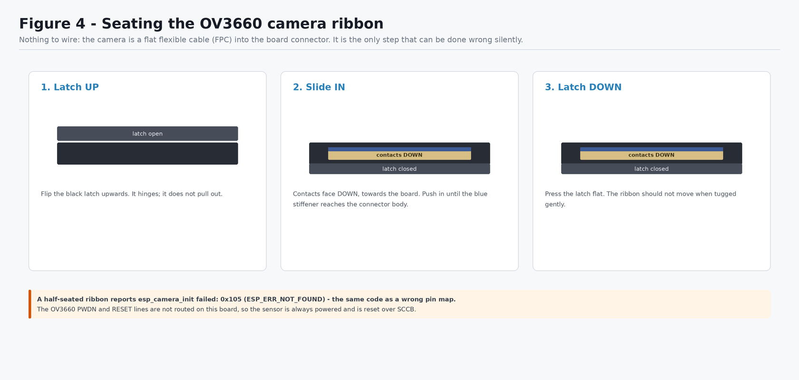

*Check: after step 3 the ribbon should not pull out under a gentle tug, and the
blue stiffener should sit flush against the connector body. This is the single
most common silent failure in the whole build.*

The camera needs **no jumper wires**. Its 14 signals run through the FPC ribbon
into the board's connector. `PWDN` and `RESET` are not routed on this board, so
the sensor is permanently powered and is reset over SCCB instead.

### 4.4 The preview — there is no display to identify

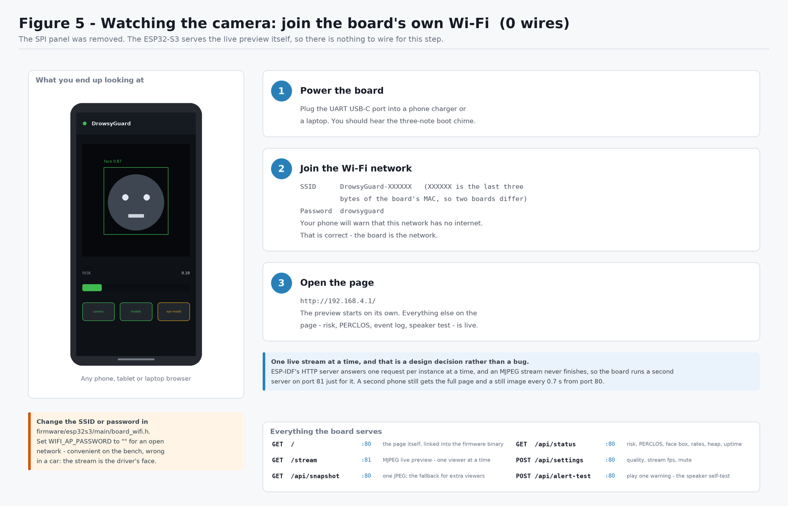

*Check: nothing to unpack for this one. The hardware you need is a phone.*

The board comes up as its own access point and serves the live preview on it:

| | |
| --- | --- |
| **SSID** | `DrowsyGuard-XXXXXX` — the last three bytes of the board's MAC, so two boards on one bench stay distinguishable |
| **Password** | `drowsyguard` |
| **Address** | `http://192.168.4.1/` |

Both are set in
[`firmware/esp32s3/main/board_wifi.h`](https://github.com/SengPhirum/PLXY_DrowsyGuard/blob/main/firmware/esp32s3/main/board_wifi.h).
Setting `WIFI_AP_PASSWORD` to `""` makes the network open, which is convenient
on the bench and wrong in a vehicle: the stream is a live video of the driver's
face.

### 4.5 The amplifier

Module silkscreen: `LRC` `BCLK` `DIN` `GAIN` `SD` `GND` `VIN`, plus a two-way
green screw terminal for the speaker. Only five of those seven pins get wired;
`GAIN` and `SD` are left alone (§6.4).

### 4.6 The microSD card

Push it into the slot on the ESP32-S3 board until it clicks. Nothing to wire.

| | |
| --- | --- |
| **Format** | FAT32. The firmware will *not* format a card it cannot read - someone's photos are not ours to erase |
| **Size** | Anything. A 1 GB card holds far more than the 1000-event cap |
| **Bus** | SDMMC 1-line on GPIO 39/38/40 (CLK/CMD/D0) - only D0 is routed on this board |

What goes on it: one JPEG per alert, plus a one-line-per-event `index.txt`,
under `/events`. The index is plain text on purpose - a car can lose power
mid-write, and a truncated last line of a text file costs one event, while a
truncated JSON array costs the whole history.

No card is not an error. The history page says so and detection carries on; the
alert path never touches the filesystem.

### 4.7 The breadboard

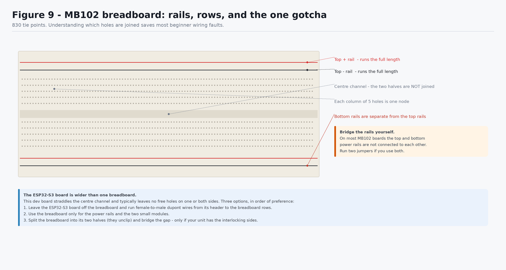

*Check: hold the board so the long red/blue rail lines run left-to-right. The
five holes in each short column are one electrical node; the two halves either
side of the centre channel are **not** connected to each other.*

---

## 5. Power architecture

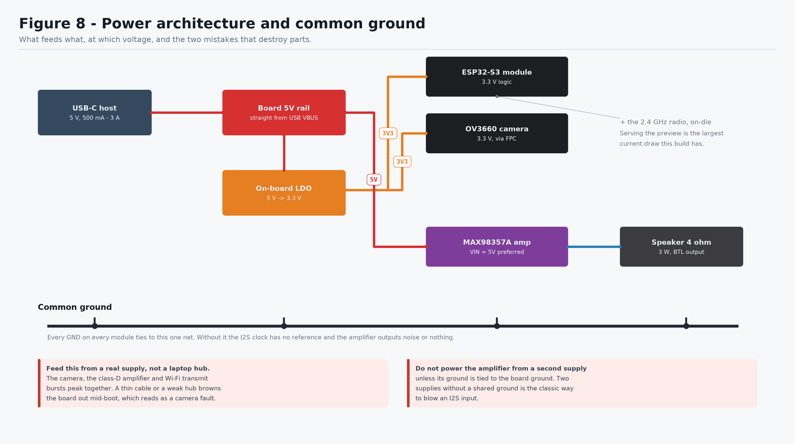

*Check before powering: the amplifier `VIN` wire is the only wire in the build
that touches **5V**, and every module `GND` must reach the same net. Trace both
with a finger before plugging in the USB cable.*

| Component | Supply | Logic level | Notes |
| --- | --- | --- | --- |
| ESP32-S3-WROOM-1 | 3.3 V (on-board LDO from USB 5 V) | 3.3 V | |
| OV3660 camera | 3.3 V via the FPC | 3.3 V | nothing to wire |
| 2.4 GHz radio | 3.3 V, on-die | — | nothing to wire, but see the current budget |
| MAX98357A | 2.5 V – 5.5 V, **use 5 V** | accepts 3.3 V logic | 3.2 W into 4 Ω needs 5 V |
| Speaker | driven by the amplifier | — | 4 Ω, 3 W, bridged output |

### Three rules

1. **Common ground.** Every `GND` on every module ties to the same net. Without
   it the I2S clock has no reference and the amplifier outputs noise or silence.
2. **No level shifters anywhere in this build.** The ESP32-S3 drives 3.3 V logic
   and the MAX98357A accepts 3.3 V logic while its `VIN` runs at 5 V — that
   combination is fine and is how the part is designed to be used. Adding a
   level shifter would only add failure modes.
3. **One supply.** Everything is powered from the single USB-C cable. If you later
   add a bench supply for the amplifier, its ground **must** still tie to the
   board ground.

### Current budget

The camera, an amplifier at full output and Wi-Fi transmit bursts peak together,
and together they can exceed what a weak USB port or a thin cable delivers. The
symptom is a boot loop with `Brownout detector was triggered`.
`sdkconfig.defaults` already lowers the brownout threshold so this does not
masquerade as a camera fault, but the real fix is a better cable, a powered hub,
or a 5 V supply.

The radio is the new item on that list. Dropping the panel removed a steady
40–60 mA of backlight, but serving an MJPEG stream replaces it with something
peakier: transmit bursts of a couple of hundred milliamps that coincide with
whatever the camera and the amplifier are doing. If the board is stable until
the moment you open the preview, this is why — and it is a supply problem, not
a firmware one.

---

## 6. Wiring

Work with the USB cable **unplugged**. Connect ground first and remove it last —
that ordering means no module is ever powered through a signal pin, which is what
quietly damages I2S inputs.

### 6.1 The definitive wiring table

| From device | From pin | To device | To pin | Voltage / signal | Purpose |
| --- | --- | --- | --- | --- | --- |
| MAX98357A | `GND` | ESP32-S3 | `GND` | 0 V | Common ground |
| MAX98357A | `VIN` | ESP32-S3 | `5V` | 5 V | Amplifier supply |
| MAX98357A | `BCLK` | ESP32-S3 | `GPIO 41` | 3.3 V digital | I2S bit clock |
| MAX98357A | `LRC` | ESP32-S3 | `GPIO 42` | 3.3 V digital | I2S word select |
| MAX98357A | `DIN` | ESP32-S3 | `GPIO 2` | 3.3 V digital | I2S data, ESP32-S3 → amp |
| MAX98357A | screw `+` | Speaker | either lead | amplified audio | Speaker drive |
| MAX98357A | screw `−` | Speaker | other lead | amplified audio | Speaker return |
| OV3660 camera | FPC ribbon | ESP32-S3 | FPC connector | — | 14-signal DVP bus |
| Your phone | Wi-Fi | ESP32-S3 | Wi-Fi | 2.4 GHz | Live preview + telemetry |
| microSD card | slot | ESP32-S3 | slot | — | Event history; push it in, no wires |

**7 wires total.** The camera contributes none — it is the ribbon — and the
preview contributes none, because it goes over the air.

### 6.2 Step by step — the preview (nothing to wire)

This section used to be eight jumper wires to an SPI panel. It is now three
actions on a phone, and it is the step that proves the camera:

1. Power the board (§10) and wait for the three-note boot chime.
2. Join the Wi-Fi network `DrowsyGuard-XXXXXX`, password `drowsyguard`.
3. Open `http://192.168.4.1/`.

The preview starts by itself. Alongside it the page shows the fused risk score
and its trigger, the PERCLOS window, eye-closure probability, yawn/nod/blink
rates, head geometry, the face box drawn over the video, an event log, and the
frame rate — plus a mute switch and a speaker self-test.

| Endpoint | Port | What it is |
| --- | --- | --- |
| `/` | 80 | the page itself, compiled into the firmware |
| `/stream` | **81** | MJPEG live preview |
| `/api/snapshot` | 80 | one JPEG — also the fallback for extra viewers |
| `/api/status` | 80 | every number on the page, as JSON |
| `/api/settings` | 80 | stream rate, JPEG quality, mute |
| `/api/alert-test` | 80 | play one warning through the speaker |

> **Why the stream is on a different port.** ESP-IDF's HTTP server handles one
> request at a time per instance, and an MJPEG stream never finishes — so a
> stream on port 80 would block the page and the API for as long as anyone was
> watching. The firmware runs a second server on port 81 for the stream alone.
> The practical consequence: **one live viewer at a time**. A second phone still
> gets the whole page, with a still image refreshed roughly once a second.

To change the SSID, the password or the channel, edit
[`firmware/esp32s3/main/board_wifi.h`](https://github.com/SengPhirum/PLXY_DrowsyGuard/blob/main/firmware/esp32s3/main/board_wifi.h);
for the ports, buffer sizes and stream defaults, see
[`firmware/esp32s3/main/web_server.h`](https://github.com/SengPhirum/PLXY_DrowsyGuard/blob/main/firmware/esp32s3/main/web_server.h).

### 6.3 Step by step — amplifier and speaker

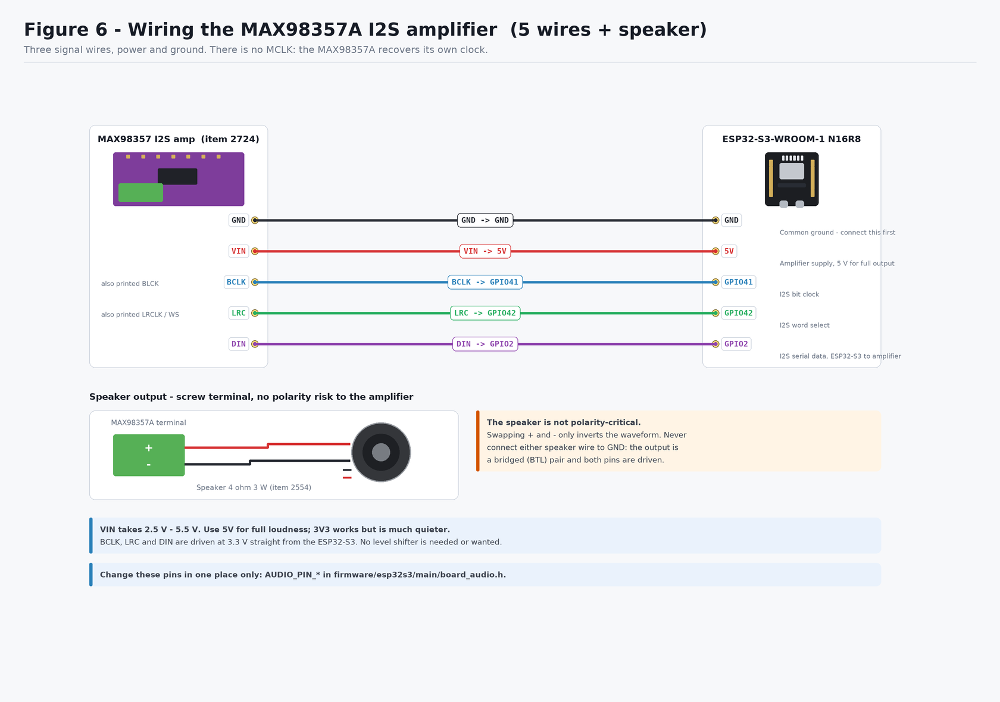

*Check: five wires to the board plus two to the speaker. `VIN` is the only wire in
the whole build that touches `5V`.*

1. Solder the 7-pin header strip to the amplifier module — the only soldering
   in this build.
2. `GND` → `GND`.
3. `VIN` → `5V`.
4. `BCLK` → `GPIO 41`.
5. `LRC` → `GPIO 42`.
6. `DIN` → `GPIO 2`.
   *(Three holes side by side on the bottom row — `41`, `42`, `2` are adjacent.
   Not 38/39/40: those are the microSD slot's bus. See §4.2.)*
7. Speaker leads into the green screw terminal, one per screw. Polarity does not
   matter — swapping them only inverts the waveform.

> **Never connect either speaker lead to ground.** The MAX98357A output is a
> bridged (BTL) pair: both terminals are actively driven, and grounding one
> shorts half the output stage.

To change these, edit `AUDIO_PIN_*` in
[`firmware/esp32s3/main/board_audio.h`](https://github.com/SengPhirum/PLXY_DrowsyGuard/blob/main/firmware/esp32s3/main/board_audio.h).

### 6.4 The two amplifier pins you do not wire

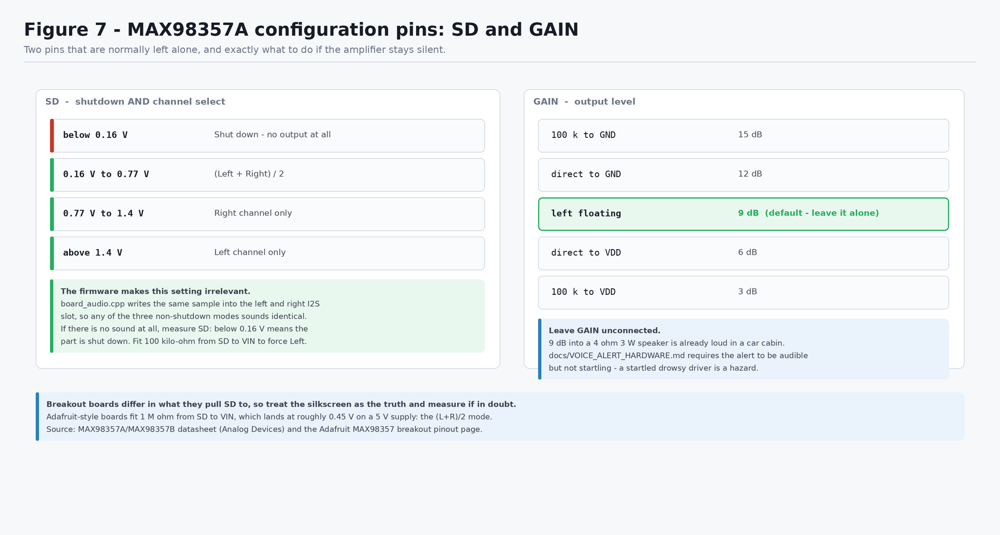

*Check: leave both `GAIN` and `SD` unconnected on the first build. Come back to
this figure only if the amplifier is silent.*

**`GAIN`** — leave floating for the default 9 dB. That is already loud into a
4 Ω 3 W speaker, and `docs/VOICE_ALERT_HARDWARE.md` requires an alert that is
audible without being startling: a startled drowsy driver is itself a hazard.

**`SD`** — this pin both shuts the amplifier down and selects a channel:

| Voltage on `SD` | Result |
| --- | --- |
| below 0.16 V | Shut down — no output at all |
| 0.16 V – 0.77 V | (Left + Right) / 2 |
| 0.77 V – 1.4 V | Right channel only |
| above 1.4 V | Left channel only |

The firmware sidesteps this entirely: `board_audio.cpp` writes the **same sample
into both the left and right slot**, so all three non-shutdown modes sound
identical and it does not matter what your particular breakout pulls `SD` to. The
only failing case is a board that leaves `SD` below 0.16 V. If there is no sound
at all, measure `SD`; if it reads near 0 V, fit a 100 kΩ resistor from `SD` to
`VIN` to force left-channel mode.

### 6.5 Everything together

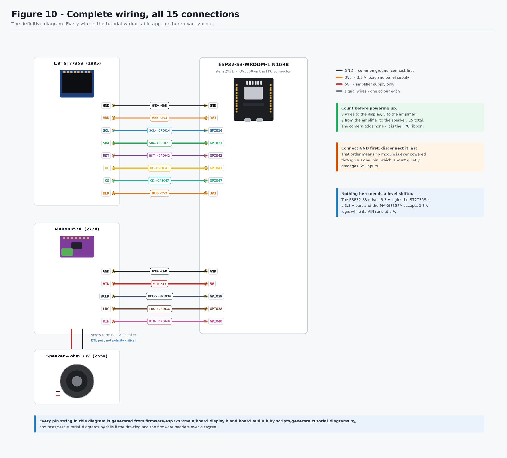

*Check: count your wires against this diagram before plugging in — 5 to the
amplifier and 2 to the speaker. Then re-trace `VIN`→`5V` and every `GND` one
final time.*

---

## 7. Software setup

Written for Windows 11 / PowerShell, which is the development machine this
project targets.

### 7.1 Install ESP-IDF

1. Download the **offline installer for ESP-IDF v5.4.x** from
   <https://dl.espressif.com/dl/esp-idf/> (~1.5 GB). Not the small "Universal
   Online Installer" — the offline one bundles its own Python 3.11.
2. Install to a path with **no spaces and no non-ASCII characters**. `C:\Espressif`
   is the default and is correct. A path like `C:\Users\Phirum Seng\...` breaks CMake.
3. Tick the driver components (CP210x / FTDI / WCH-CH34x) when offered.
4. Let it finish completely — it keeps unpacking after the progress bar looks done.

### 7.2 Enable long paths

ESP-IDF build trees exceed the Windows 260-character limit. Once, in an
**Administrator** PowerShell, then reboot:

```powershell
New-ItemProperty -Path 'HKLM:\SYSTEM\CurrentControlSet\Control\FileSystem' `
  -Name LongPathsEnabled -Value 1 -PropertyType DWORD -Force
```

### 7.3 Open an ESP-IDF shell

`idf.py` is **not** a global command and never appears on the system PATH. An
ordinary terminal will always say `idf.py not found`.

Start menu → **ESP-IDF 5.4 PowerShell**. Then:

```powershell
idf.py --version    # expect: ESP-IDF v5.4.x
```

To get the same environment in a terminal you already have open:

```powershell
. C:\Espressif\frameworks\esp-idf-v5.4.4\export.ps1
```

### 7.4 Find the board

Plug the USB-C cable into the **UART** port, then:

```powershell
[System.IO.Ports.SerialPort]::GetPortNames()
```

Nothing listed? In order: try another cable (must carry data), check Device
Manager for a yellow-triangle "USB2.0-Serial" and install the
[WCH CH34x driver](https://www.wch-ic.com/downloads/CH341SER_EXE.html), then try
the other USB-C port.

### 7.5 Prove the toolchain before touching this project

Five minutes here saves an hour of misattributed errors later:

```powershell
cd $env:USERPROFILE
Copy-Item -Recurse "$env:IDF_PATH\examples\get-started\hello_world" .\hw_test
cd .\hw_test
idf.py set-target esp32s3
idf.py -p COM5 flash monitor      # substitute your port
```

Expect a chip banner and a countdown. `Ctrl+]` exits the monitor.

---

## 8. Project configuration

Everything the board needs is already committed. These are the files that decide
whether it works, and what to change if your hardware differs.

| File | What it controls | Change it when |
| --- | --- | --- |
| `firmware/esp32s3/main/board_wifi.h` | SoftAP SSID, password, channel; optional station credentials | you want a different network name, or the board to join your lab Wi-Fi as well |
| `firmware/esp32s3/main/web_server.h` | HTTP ports, JPEG quality and stream rate defaults, buffer ceiling | the preview is too heavy for your link, or a port is taken |
| `firmware/esp32s3/main/web/index.html` | the page itself | you want different numbers on screen |
| `firmware/esp32s3/main/board_audio.h` | `AUDIO_PIN_*`, sample rate, tone amplitude | you wire the amplifier to different pins, or it is too loud/quiet |
| `firmware/esp32s3/main/board_camera.h` | DVP pin map, frame size, byte order | never, unless your board is not this board |
| `firmware/esp32s3/sdkconfig.defaults` | PSRAM mode, flash size, CPU speed, sensor support | see the table below |
| `firmware/esp32s3/partitions.csv` | 6 MB app + 4 MB asset partition | you embed large audio clips |
| `firmware/esp32s3/main/main.cpp` | `RISK_TRIGGER` (0.55) | after tuning on the desktop dashboard |

`idf.py set-target esp32s3` seeds `sdkconfig` from `sdkconfig.defaults`, which
already sets the things that are easy to get wrong:

| Setting | Value | Consequence if wrong |
| --- | --- | --- |
| `CONFIG_SPIRAM` | `y` | camera cannot allocate framebuffers |
| `CONFIG_SPIRAM_MODE_OCT` | `y` | **an R8 board reports 0 B PSRAM in quad mode** |
| `CONFIG_ESPTOOLPY_FLASHSIZE_16MB` | `y` | truncated image / boot loop |
| `CONFIG_OV3660_SUPPORT` | `y` | sensor not detected (`0x105`) |
| `CONFIG_ESP_DEFAULT_CPU_FREQ_MHZ_240` | `y` | roughly half the frame rate |
| `CONFIG_ESP_WIFI_STATIC_TX_BUFFER_NUM` | `24` | the preview stalls in bursts and reads as a slow camera |
| `CONFIG_LWIP_TCP_SND_BUF_DEFAULT` | `65534` | same — MJPEG needs the window |

---

## 9. Code / firmware setup

The I2S audio path for the MAX98357A is **already integrated** in this
repository — you do not have to write it:

| File | What it does |
| --- | --- |
| `main/board_audio.h` / `.cpp` | I2S bring-up on GPIO 38/39/40, PCM playback, tone generator |
| `main/voice_alert.cpp` | Alert state machine, reason-specific tone patterns, buzzer fallback |
| `main/main.cpp` | Plays a three-note chime at boot as a built-in audio self-test |
| `main/board_wifi.*` | SoftAP bring-up (plus optional station mode) |
| `main/web_server.*` | Two HTTP servers, MJPEG encoding, status JSON, controls |
| `main/web/index.html` | The page, linked into the binary as flash rodata |

Two design points worth knowing:

- **Playback runs on its own FreeRTOS task.** The capture loop has a ~23 ms frame
  budget; playing even a half-second alert inline would drop roughly twenty
  frames and stall the preview at the exact moment there is something worth
  looking at.
- **Mono is written to both I2S slots**, which is what makes the amplifier's
  `SD` pin configuration irrelevant (§6.4).
- **The alert repeat cap resets after five minutes of calm.** Three warnings per
  episode, not three per power cycle: with the panel gone the speaker is the only
  thing the driver perceives, and an alarm that goes permanently quiet after
  three events on a long drive would be the one failure mode this device cannot
  have. See `repeat_reset_ms` in `main/voice_alert.h`.
- **JPEG encoding never blocks detection.** The capture loop copies the frame
  into one of two PSRAM buffers and returns; the ~20 ms encode happens in the
  stream task, on the other core, and is skipped entirely when no page is open.

Recorded speech is not committed. Until approved English/Khmer clips exist (see
`firmware/esp32s3/assets/audio/README.md`), each alert reason plays a distinct
tone pattern — a real, audible alert rather than a log line.

### Build and flash

```powershell
cd <repo>\firmware\esp32s3
idf.py set-target esp32s3          # seeds sdkconfig from sdkconfig.defaults
idf.py reconfigure                 # fetches managed components, writes dependencies.lock
idf.py build
idf.py -p COM5 flash monitor       # substitute your port
```

If flashing refuses to start: **hold BOOT, tap RESET, release BOOT**, then flash.

---

## 10. First power-on

Do this in order. Do not skip to the last step.

1. **USB unplugged.** Re-check the wiring table in §6.1 one wire at a time.
2. Confirm `VIN` → `5V`, and that no speaker lead touches `GND`.
3. Confirm no wire touches `GPIO 33`–`GPIO 37`.
4. Confirm the camera ribbon is latched.
5. Plug the USB-C cable into the **UART** port.
6. **Watch and smell for the first five seconds.** Any heat, smell or visible
   smoke — unplug immediately and re-check §6.1.
7. Run `idf.py -p COM5 flash monitor`.

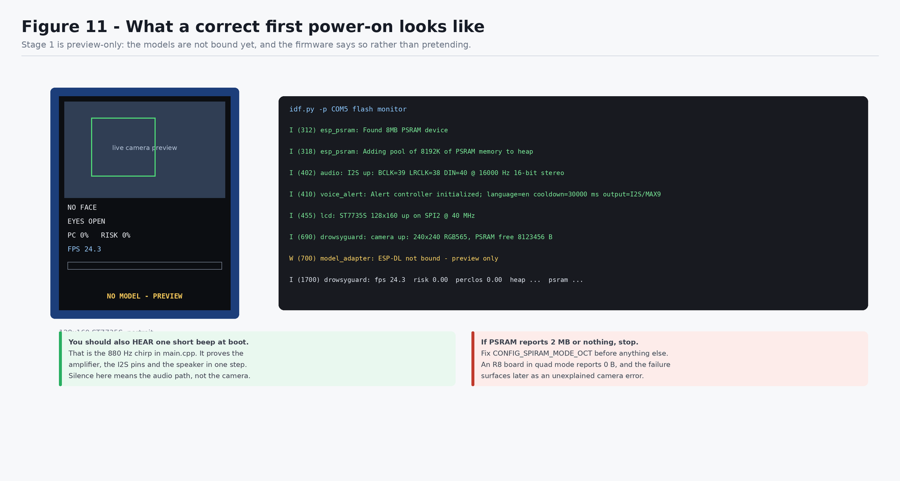

*Check: you should **hear three rising notes**, then find `DrowsyGuard-XXXXXX` in
your phone's Wi-Fi list and a live preview at `http://192.168.4.1/`. The chime
proves the amplifier, the I2S pins and the speaker in one step; the preview
proves the camera, the ribbon, the pin map, PSRAM, the radio and the power
supply.*

The three failures at this point look nothing alike, which is the point of
having both signals:

| What you get | What it means |
| --- | --- |
| No chime | Audio path — the amplifier or its wiring, not the camera |
| Chime, but no SSID in the Wi-Fi list | The radio never started; check PSRAM came up first |
| SSID present, page will not load | Right network, wrong address — it is `192.168.4.1`, not a `.local` name |
| Page loads, preview dark | The camera. The status pills on the page name the failed subsystem |

These two lines must appear in the boot log:

```
I (xxx) esp_psram: Found 8MB PSRAM device
I (xxx) esp_psram: Adding pool of 8192K of PSRAM memory to heap allocator
```

If it reports 2 MB, or nothing, **stop** and fix `CONFIG_SPIRAM_MODE_OCT` before
anything else. Everything downstream will misbehave in ways that look unrelated.

---

## 11. Testing each component individually

Test in this order. Each step assumes the previous one passed.

| # | Component | How to test | Pass looks like |
| --- | --- | --- | --- |
| 1 | Toolchain | `idf.py --version` | `ESP-IDF v5.4.x` |
| 2 | USB / serial | `[System.IO.Ports.SerialPort]::GetPortNames()` | a `COM` port appears |
| 3 | Board | flash `hello_world` | chip banner + countdown |
| 4 | PSRAM | flash DrowsyGuard, read the boot log | `Found 8MB PSRAM device` |
| 5 | **Audio** | listen at boot | three rising notes |
| 6 | Wi-Fi | look at your phone's network list | `DrowsyGuard-XXXXXX` appears |
| 7 | Web server | open `http://192.168.4.1/` | the page loads and the status pills fill in |
| 8 | Camera | watch the preview | live moving image |
| 9 | Frame rate | the `fps` pill, or the once-a-second log line | `fps` above 15 |
| 10 | Alert path | press **Test speaker** on the page | the chosen warning plays, and a line appears in the event log |

Testing audio first is deliberate: the boot chime is the cheapest signal in the
system and needs no network, so if it is silent you know the fault is in the
audio path rather than anywhere else.

Row 10 replaces what used to be a temporary code edit. The speaker self-test is
a button on the page precisely because there is no longer a panel to read: with
no local output, "no alert fired" and "the amplifier is dead" would otherwise be
indistinguishable.

---

## 12. Full system test

With all components passing individually:

1. Flash and let the board run for a full minute.
2. Confirm the once-a-second log line advances and `fps` stays above 15:
   ```
   I (xxx) drowsyguard: fps 15.2  risk 0.00  perclos 0.00  face 18/20 ... viewers 1 ...
   ```
3. Sit in front of the camera. The preview should track you and the face box
   should follow your head; it turns amber when the box is being held between
   detections rather than freshly detected.
4. Watch `fps` with the preview open and again with the tab closed. A few frames
   per second of difference is expected — the JPEG encode is real work. A large
   drop means the stream rate is set too high for the link: turn it down on the
   page.
5. Confirm `heap` and `psram` are stable across a minute — a falling number is a
   leak, and `docs/DEPLOYMENT.md` has a one-hour heap-stability acceptance test.
   Open and close the preview a few times while watching: a stream that leaks
   would show up here first.
6. Press **Test speaker** and confirm the tone plays **and** the preview keeps
   updating during playback. If the preview freezes while the tone plays, the
   audio task is not running and something is wrong with §9.

At this point the hardware is proven. What remains is model work, not wiring:
`docs/HARDWARE_SETUP.md` §8 covers binding ESP-DL, and `PROJECT_STATE.md` gap 6
explains why the eye model still classifies poorly in visible light.

---

## 13. Troubleshooting

### Power and connection

| Symptom | Likely cause | Fix |
| --- | --- | --- |
| No COM port | Charge-only cable, or missing CH34x driver | Data cable; install driver; try the other USB-C port |
| `idf.py not found` | Plain terminal instead of an ESP-IDF shell | Use the ESP-IDF PowerShell shortcut, or dot-source `export.ps1` |
| Works in one terminal, not another | `export.ps1` is per-session | Re-run it in each new terminal |
| `Failed to connect ... Wrong boot mode` | Not in download mode | Hold BOOT, tap RESET, release BOOT, reflash |
| Boot loop, `Brownout detector was triggered` | USB port cannot supply camera + radio + amp | Powered hub, shorter/thicker cable, or a 5 V supply |
| Stable until you open the preview, then resets | Transmit bursts on a marginal supply | Same fixes; or lower the stream rate on the page |
| Nothing at all, board warm | Short, or a supply wire on the wrong pin | Unplug. Re-check `VIN`→`5V` and that no speaker lead is on `GND` |

### Camera

| Symptom | Likely cause | Fix |
| --- | --- | --- |
| `esp_camera_init failed: 0x105` | Ribbon half-seated, PSRAM off, or wrong pin map | Reseat the ribbon; check the 8 MB PSRAM line; check `CONFIG_OV3660_SUPPORT` |
| `esp_camera_init failed: 0x101` | PSRAM not enabled | `CONFIG_SPIRAM=y` **and** `CONFIG_SPIRAM_MODE_OCT=y` |
| Preview mirrored the wrong way | Mounting orientation | `set_hmirror` / `set_vflip` in `board_camera_tune()` |
| Preview colours are psychedelic — red and blue swapped | RGB565 byte order into the JPEG encoder | Set `CAM_RGB565_BYTE_SWAP` to `0` in `board_camera.h` |
| Preview very dark or washed out | Auto-exposure fighting a backlit windscreen | `set_brightness` / `set_gain_ctrl` in `board_camera_tune()` |

### Wi-Fi and the preview

| Symptom | Likely cause | Fix |
| --- | --- | --- |
| No `DrowsyGuard-` network anywhere | The radio never started | Look for the `wifi: SoftAP ... up` line in the log; if PSRAM failed first, fix that — the Wi-Fi stack allocates from it |
| SSID visible, phone will not connect | Password mismatch, or `WIFI_AP_PASSWORD` shorter than 8 characters | WPA2 needs 8+; check `board_wifi.h` |
| Connected, but the page times out | Wrong address | It is `http://192.168.4.1/`. Not a `.local` name, and not `https` |
| Page loads, preview stays on "opening live stream" | Another viewer holds the single stream slot | Close the other tab, or use the **Use still photos** button |
| Preview arrives in bursts, seconds apart | Wi-Fi power save on, or the TCP window too small | Confirm `esp_wifi_set_ps(WIFI_PS_NONE)` ran, and that `sdkconfig` kept the `CONFIG_LWIP_TCP_SND_BUF_DEFAULT` value from `sdkconfig.defaults` |
| Preview smooth but the numbers freeze | The status poll is failing while the stream survives | The header dot turns red — check the log for a crash in the capture loop |
| `jpeg overflowed ... lower it` in the log | Quality too high for the encode buffer | Lower the quality slider, or raise `WEB_JPEG_BUFFER_BYTES` |
| Everything works, then the page dies after a while | The board rebooted; the uptime on the page resets | Read the log — a brownout or a panic, not a network fault |

### Audio

| Symptom | Likely cause | Fix |
| --- | --- | --- |
| No boot beep, log says `output=buzzer` | I2S failed to initialise | Check `AUDIO_PIN_*` do not collide with §4.2 |
| No boot beep, log says `output=I2S/MAX98357A` | Wiring, or the amplifier is shut down | Check `GND`, `VIN`, then measure `SD` — below 0.16 V means shutdown (§6.4) |
| Loud hiss or buzz, no tone | Missing common ground | Tie every module `GND` together |
| Very quiet | `VIN` on `3V3` instead of `5V` | Move `VIN` to `5V` |
| Distorted / clipping | Gain too high for the speaker | Lower `AUDIO_TONE_AMPLITUDE` in `board_audio.h` |
| Tone plays but preview freezes | Playback running inline, not on its task | Confirm `voice_alert_init` returned true |
| Click at the start of every tone | Ramp too short | Increase the 5 ms ramp in `board_audio_play_tone` |

### Build

| Symptom | Likely cause | Fix |
| --- | --- | --- |
| CMake path errors, `filename too long` | Project or IDF in a path with spaces, or long paths disabled | Reinstall IDF to `C:\Espressif`; enable `LongPathsEnabled` |
| `esp_camera.h: No such file` | Managed components not fetched | `idf.py reconfigure` |
| `_binary_index_html_start` undefined | `EMBED_TXTFILES` line missing from `main/CMakeLists.txt` | Restore it — the page is linked in from `main/web/index.html` |
| `driver/i2s_std.h: No such file` | ESP-IDF older than v5.0 | Install v5.4.x — the legacy `i2s.h` API is not used here |
| `fps` far below 15 | CPU at 160 MHz, or the stream rate set too high | Check `CONFIG_ESP_DEFAULT_CPU_FREQ_MHZ_240`; lower the stream rate on the page |

---

## 14. Final verification checklist

- [ ] All four components identified and accounted for
- [ ] Header strip soldered to the amplifier
- [ ] Camera ribbon latched and does not pull out
- [ ] Amplifier `VIN` on `5V`
- [ ] Neither speaker lead on `GND`
- [ ] Every module `GND` on a common ground
- [ ] No wire on `GPIO 33`–`GPIO 37`
- [ ] All 7 connections match the table in §6.1
- [ ] ESP-IDF v5.4.x installed, `idf.py --version` works
- [ ] `hello_world` flashes and runs
- [ ] Boot log shows `Found 8MB PSRAM device`
- [ ] Three rising notes at boot
- [ ] `DrowsyGuard-XXXXXX` appears in the Wi-Fi list
- [ ] `http://192.168.4.1/` loads and every status pill is green
- [ ] Live camera preview visible in the browser
- [ ] `fps` above 15, with the preview open
- [ ] Heap and PSRAM stable over a minute, across a few stream open/close cycles
- [ ] **Test speaker** produces a tone without stalling the preview

---

## 15. References

**Product listings**

- [khmeres.com item 2991 — ESP32-S3 N16R8 development board with OV3660](https://khmeres.com/product_detail/2991)
- [khmeres.com item 2724 — MAX98357 I2S audio amplifier filterless class D](https://khmeres.com/product_detail/2724)
- [khmeres.com item 2554 — High quality speaker 3 watt 4 ohm 40mmX22mm](https://khmeres.com/product_detail/2554)
- [khmeres.com item 371 — Breadboard 830 point solderless MB102 test board](https://khmeres.com/product_detail/371)

**Datasheets and component documentation**

- MAX98357A/MAX98357B PCM Input Class D Audio Power Amplifiers — Analog Devices
  (supply range, `SD_MODE` thresholds, `GAIN_SLOT` table, 3.2 W into 4 Ω at 5 V,
  filterless output stage)
- [Adafruit MAX98357 I2S Class-D Mono Amp — pinouts](https://learn.adafruit.com/adafruit-max98357-i2s-class-d-mono-amp/pinouts)
  (`SD` internal 100 kΩ pulldown and pull-up selection)
- [keyestudio MB0184 ESP32-S3 CAM pin table](https://docs.keyestudio.com/projects/MB0184/en/latest/docs/MB0184%20ESP32-S3%20CAM%20Development%20Board.html)
- [arduino-esp32 `camera_pins.h` (ESP32S3_EYE map)](https://github.com/espressif/arduino-esp32/blob/master/libraries/ESP32/examples/Camera/CameraWebServer/camera_pins.h)
- [espressif/esp32-camera component](https://components.espressif.com/components/espressif/esp32-camera)
  (also the source of `fmt2jpg_cb`, the JPEG encoder the preview uses)
- [ESP-IDF HTTP Server API reference](https://docs.espressif.com/projects/esp-idf/en/stable/esp32s3/api-reference/protocols/esp_http_server.html)
  (one request per instance at a time — the reason the stream has its own port)
- [ESP-IDF Wi-Fi API reference — SoftAP](https://docs.espressif.com/projects/esp-idf/en/stable/esp32s3/api-guides/wifi.html)

**In this repository**

- [`docs/HARDWARE_SETUP.md`](../../HARDWARE_SETUP.md) — toolchain reference and the ESP-DL binding stages
- [`docs/VOICE_ALERT_HARDWARE.md`](../../VOICE_ALERT_HARDWARE.md) — alert architecture and thesis measurements
- [`docs/FIRMWARE_PIPELINE.md`](../../FIRMWARE_PIPELINE.md) — frame budget
- [`docs/DEPLOYMENT.md`](../../DEPLOYMENT.md) — hardware acceptance tests
- [`PROJECT_STATE.md`](https://github.com/SengPhirum/PLXY_DrowsyGuard/blob/main/PROJECT_STATE.md) — known gaps

---

## About the diagrams

Every figure is generated by
[`scripts/generate_tutorial_diagrams.py`](https://github.com/SengPhirum/PLXY_DrowsyGuard/blob/main/scripts/generate_tutorial_diagrams.py)
from the same constants the firmware uses, and
[`tests/test_tutorial_diagrams.py`](https://github.com/SengPhirum/PLXY_DrowsyGuard/blob/main/tests/test_tutorial_diagrams.py)
fails the build if a drawing and a firmware header ever disagree. To regenerate:

```bash
python scripts/generate_tutorial_diagrams.py
```
